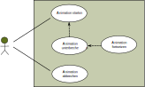
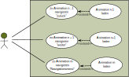

# Pflichtenheft
#####  (Nach Ludewig und Lichter, 351-358)

| Version | Autor | Quelle | Status | Datum | Kommentar |
| ------- | ----- | ------ | ------ | ----- | --------- |
|  0.1    |  Georg Fischer   | lastenheft.md | in Bearbeitung  | 19.03.2024 | Datei erstellt |
|  0.2    |  Georg Fischer   | lastenheft.md | in Bearbeitung  | 20.03.2024 | Pkt. 1.1 - 1.3 bearbeitet |
|  0.3    |  Georg Fischer   | lastenheft.md | in Bearbeitung  | 21.03.2024 | Pkt. 1.4 - 2.5 (ausgenommen 2.2) bearbeitet |
|  0.4    |  Georg Fischer   | lastenheft.md | in Bearbeitung  | 22.03.2024 | Pkt. 2.2 bearbeitet |
|  0.5    |  Georg Fischer   | lastenheft.md | in Bearbeitung  | 23.03.2024 | Use-case 1 (Anhang) hinzugefügt |
|  0.6    |  Georg Fischer   | lastenheft.md | in Bearbeitung  | 10.04.2024 | Use-case 2 (Anhang) hinzugefügt |

## 1. Einleitung

### 1.1 Zweck

Der **Zweck** dieses Pflichtenhefts ist es, die Anforderungen, die sich aus dem Lastenheft ergeben, aus der Sicht des
Programmierers zu präzisieren, Anwendungsfälle ("Use-cases") inklusive etwaiger Ausnahmen und Sonderfälle zu 
definieren, sodass darauf aufbauend das Design der Applikation erstellt werden kann. Der **Leserkreis** eines
Pflichtenhefts wäre im Regelfall der Auftraggeber, im konkreten Spezialfall dieses Projekts ist es der Autor 
(Programmierer) selbst. Daher sind die Abnahmekriterien (Pkt. 4) auch sehr kurz gehalten.

### 1.2 Einsatzbereich und Ziele

Der **vorrangige Einsatzbereich** der Applikation soll der Informatikunterricht an der gymnasialen 
Oberstufe sein. Die **Ziele** sind, dass Lernenden ohne Vorwissen die fundamentalen Konzepte einer Blockchain 
vermittelt werden und es dabei für die Lernenden die Möglichkeit gibt, an bestimmten Stellen interaktiv einzugreifen. 
Die **Vision** hinter diesen Zielen ist, dass durch die Anwendung der Applikation die fundamentalen Konzepte einer 
Blockchein schneller und effizienter verstanden und gelernt werden können. Daher ist es ein weiteres Ziel, dass die
Applikation optisch ansprechend gestaltet ist.

Ein **weiterer Einsatzbereich** ist die selbstständige Anwendung der Applikation durch User ausserhalb des Unterrichts,
ohne formellen Rahmen und ohne vermittelnde Lehrperson. Daher ist es ein weiteres **Ziel**, dass die Applikation
selbsterklärend und intuitiv bedienbar ist.

Was die Applikation **nicht leisten** kann, ist, dass den Lernenden sämtliche Konzepte einer Blockchain detailliert und
vollständig vermittelt werden. Sie werden nach der Anwendung nicht in der Lage sein, selbst eine Blockchain-Anwendung zu
programmieren, es geht auch nicht darum, Wissen oder Kompetenzen zu erlangen, wie man eine konkrete existierende
Blockchain-Anwendung (z.B. die Bitcoin-Blockchain) verwendet, d.h. welche Software dafür installiert und wie diese
bedient werden muss.

### 1.3 Definitionen

| **Begriff** | **Erklärung** |
| ----------- | ------------- |
| Adresse | eine eindeutig identifizierbare, pseudonyme Identität eines Knotens einer Blockchain, bestehend aus dem öffentlichen Schlüssel eines zufällig erzeugten Schlüsselpaars |
| asymmetrische Verschlüsselung | Verschlüsselungsverfahren, bei dem für die Verschlüsselung und die Entschlüsselung zwei unterschiedliche Schlüssel verwendet werden |
| Block | Einheit von Daten in einer Blockchain-Datenstruktur, bestehend aus einem Block-Header und einem Merkle-Tree mit Hash-Referenzen auf die Transaktionsdaten ("Inhalt") |
| Blockchain-Datenstruktur | Organisation von Transaktionsdaten in miteinander verketteten Einheiten ("Blöcken") |
| Block-Header | Kopf eines Blocks einer Blockchain, bestehend (zumindest) aus der Hash-Referenz auf den vorherigen Block-Header, der Wurzel eines Merkle-Trees, dem Schwierigkeitsgrad für das Hashpuzzle ("Target"), einem Zeitstempel und einer Nonce |
| digitale Signatur | ein mit dem privaten Schlüssel verschlüsselter und zusammen mit einer Nachricht verschickter Hashwert der Nachricht, der die Authentifizierung der Nachricht ermöglicht |
| Hash-Referenz | ein Hash-Wert, der auf Daten (z.B. Transaktionsdaten) verweist, die an einem anderen Ort gespeichert sind |
| Hashpuzzle | eine Berechnungsaufgabe, bei der ein Hashwert mit einem bestimmten Target gesucht wird und die nur durch die Trial-and-Error-Methode zu lösen ist, indem den Daten, die gehasht werden, eine sich ständig ändernde Nonce hinzugefügt wird |
| Hashwert | eine Zahl mit fixer Länge, die von einer Hashfunktion bzw. einem Hashalgorithmus aus Daten unterschiedlicher Länge berechnet wird |
| Merkle-Tree | ein Binär-Baum, dessen Blätter Transaktionsdaten enthalten und dessen Knoten erzeugt werden, indem man Hashwerte aus den jeweils darunterliegenden Teilbäumen kombiniert und daraus einen neuen Hashwert generiert; die Wurzel des Baumes ist ebenfalls ein Hashwert |
| Mining | der Versuch, ein Hashpuzzle zu lösen, um einen neuen Block an die Blockchain anfügen zu können; im Erfolgsfall gibt es für die bereitgestellte Rechnerleistung in der Regel eine Entlohnung |
| Nonce | eine einmalige Zahlenfolge ("Number used once"), die einem Block-Header hinzugefügt und dazu benötigt wird, das Hashpuzzle zu lösen |
| Peer-to-Peer System | ein verteiltes Softwaresystem aus Einzelcomputern ("Knoten"), die sich ihre Berechnungsressourcen teilen und bei denen jeder Knoten die gleiche Funktionalität und Verantwortung hat |
| Proof-of-Work | ein Algorithmus, der dazu führt, dass unter den einzelnen Knoten des Peer-to-Peer-Systems ein Konsens über die Gültigkeit eines neuen Blocks gefunden wird, indem die Lösung eines Hashpuzzles als Beweis für die Gültigkeit des Blocks und als Arbeitsnachweis dient |
| Schlüsselpaar | in einem asymmetrischen Verschlüsselungsverfahren ein Paar aus einem öffentlichen und einem privaten Schlüssel |
| Target | der Schwierigkeitsgrad eines Hashpuzzles, angegeben durch eine Zahl; der gesuchte Hashwert (die Zahl, die das Hashpuzzle löst) muss kleiner sein als diese Zahl |
| Transaktion | Übertragung von Werten innerhalb einer Blockchain von einer Adresse zu einer anderen Adresse |
| User | jede Person, welche die Applikation anwendet, gleichgültig in welchem Einsatzbereich | 

### 1.4 Referenzierte Dokumente

Das **Lastenheft** mit den Anforderungen an die Applikation aus der Sicht des Auftraggebers.

### 1.5 Überblick

* In **Pkt. 2** dieses Pflichtenhefts wird die Applikation allgemein beschrieben.
* In **Pkt. 3** werden die im Lastenheft formulierten Anforderungen detailliert aufgelistet. Unterstützend dafür finden
sich im Anhang skizzierte und beschriebene Use-cases.
* **Pkt. 4** ist aufgrund der speziellen Situation, dass es sich um das "individuelle Projekt" im Rahmen des 
Studienprogramms GymInf handelt und es keinen Auftraggeber im eigentlichen Sinn gibt, der am Ende das fertige
Produkt abnimmt, kurz gehalten.
* Im **Anhang** finden sich die Use-cases, die sich aus dem Lastenheft (/LK10/ bis /LK80/ sowie /LF10/ bis /LF40/
und /LQF10/ bis /LQE10/) ergeben.

## 2. Allgemeine Beschreibung

### 2.1 Einbettung

* Die Applikation steht für sich selbst, ist nicht Teil einer grösseren Anwendung und auch nicht von anderen Anwendungen
  abhängig.
* Die Realisierung erfolgt als Web-Applikation, für die Umsetzung werden HTML, CSS und JavaScript verwendet.
* Die Ausführung der Applikation sowie der eingebetteten Skripte erfolgt auf der Client-Seite.

### 2.2 Funktionen

* Die Applikation besteht aus einer Anzahl von animierten Grafiken, über die a) durch das Klicken von "weiter"- und
  "zurück"-Buttons navigiert werden kann oder die b) über ein Navigationsmenü direkt angesteuert werden können.
* Alle animierten Grafiken können vom User durch das Klicken von Buttons gestartet, unterbrochen, fortgesetzt oder
  abgebrochen werden.
* Bei allen animierten Grafiken gibt es (vor dem Start und/oder nach Beendigung bzw. Abbruch der Animation) die Möglichkeit,
  dass durch das Klicken auf ein intuitiv verständliches Symbol erklärende Texte aufpoppen. Dabei wird optisch unterschieden
  zwischen Erklärungen, die sich direkt auf das in der Animation Gezeigte beziehen, und weiterführenden Texten, die über das
  in der Animation Gezeigte hinausgehen.
* Bei bestimmten Animationen gibt es für den User die Möglichkeit, durch (Text-)Eingaben über ein Formular die Gestaltung
  der Animationen interaktiv zu beeinflussen, wobei einmal getätigte Eingaben auch Auswirkungen auf die Gestaltung danach
  folgender Animationen haben können.

### 2.3 Benutzerprofile

* **Schülerinnen und Schüler der gymnasialen Oberstufe:** eine informatische Grundbildung, die in der Sekundarstufe
  erfolgt, kann vorausgesetzt werden; es wird davon ausgegangen, dass keine Kenntnisse über Blockchains, Hashfunktionen
  und asymmetrische Verschlüsselungsverfahren vorhanden sind
* **"freie" User:** eine etwaige informatische Vorbildung kann nicht vorausgesetzt werden, trotzdem wird davon
  ausgegangen, dass diese vergleichbar mit jener von Schülerinnen und Schülern der gymnasialen Oberstufe ist

Für alle User gilt die Voraussetzung, dass sie der deutschen Sprache mächtig sind.

### 2.4 Einschränkungen
* Die Applikation soll lediglich in deutscher Sprache zur Verfügung stehen, es sind keine Übersetzungen geplant.
* Es ist möglich, dass einige Animationen so gross werden, dass sie auf einem kleinen, hochformatigen Bildschirm (z.B.
  Smartphone) nicht zur Gänze darstellbar sind.
* Das "individuelle Projekt" im Studienprogramm GymInf dient dazu, dass Studierenden ihre im Studium erworbenen Kenntnisse
  in die Praxis umsetzen. Daher versucht der Autor (Programmierer), soweit das möglich ist, den notwendigen Code
  eigenhändig zu schreiben und auf Bibliotheken, Templates, APIs, ... weitestgehend zu verzichten. Es ergibt sich von
  selbst, dass das zu einer Einschränkung in der Qualität der Applikation führt.

### 2.5 Annahmen und Abhängigkeiten
* Angenommen wird, dass die User moderne Browser verwenden, die HTML5, CSS3 und JavaScript beherrschen.
* Bei der Konzeption der Animationen wird angenommen, dass die User die Applikation mehrheitlich auf grösseren,
  querformatigen Bildschirmen anwenden.
* Es bestehen keine Abhängigkeiten zu anderen Systemen oder anderer Software.

## 3. Einzelanforderungen

Beschreibt die Anforderung i so genau, dass bei der Verwendung der Spezifikation (im Entwurf usw.) keine Rückfragen dazu notwendig sind.

Identifizieren Sie jede Funktionale Anforderung mit einer Nummer, so dass diese Nachverfolgbar sind. Zusammengehörende Funktionale Anforderungen können durch geeignete Nummerierung angezeigt werden.

Zur Spezifikation der Software sollen Sprachschablonen benutzt werden.

* /F10/ Funktion 1 des Systems
* /F11/ Weitere Detaillierung Funkion 1
* /F20/ Funktion 2 des Systems

Die Funktionalen Anforderungen sollen mithilfe von Use-cases erhoben werden. Die Use-cases sollen in Anhang A detailliert beschrieben werden.

## 4. Abnahmekriterien

Beschreiben Sie hier, wie die Anforderungen bei der Abnahme auf ihre Realisierung überprüft werden können.

Definieren Sie hier mindestens ein Abnahmekriterium
* /A10/ Abnahmekriterium 1
* /A20/ Abnahmekriterium 2

# Anhang

## Anhang A. Use-cases

### Use-Case 1 - gilt für alle Animationen:

* Name: *Animation n starten / unterbrechen / fortsetzen / abbrechen*
* Akteur: *User*
* Vorbedingungen: *Der User hat zu einer Animation navigiert, die Animation ist vollständig geladen.*
* Standardablauf:
    * Der User startet die Animation n.
      * (Optional, mehrfach möglich: Der User unterbricht die Animation.)
      * (Optional, nur nach Unterbrechen der Animation möglich: Der User setzt die Animation fort.)
      * (Optional: der User bricht die Animation ab.)
    * Die Animation ist beendet.
* Nachbedingung Erfolg: *Der letzte Frame der Animation wird am Bildschirm angezeigt.*
* Nachbedingung Sonderfall 1a: *Die vom User gewählte Animation wird geladen.*

#### Sonderfall 1a: Der User navigiert von der Animation weg.
* Ablauf Sonderfall 1a
    * Der User betätigt die "weiter"- oder "zurück"-Buttons oder wählt eine Animation im Navigationsmenü.
    * Der User navigiert zur nachfolgenden ODER zur vorherigen ODER zu einer beliebigen Animation.

### Use Case 2 - gilt für alle Animationen:

* Name: *Navigation zwischen den einzelnen Animationen*
* Akteure: *User*
* Vorbedingungen: *Der User hat zu einer beliebigen Animation n navigiert.*
* Standardablauf:
    * Der User navigiert zur vorherigen Animation n-1 durch Klicken auf einen "Zurück"-Button
    * ODER: Der User navigiert zur nachfolgenden Animation n+1 durch Klichen auf einen "Weiter"-Button
    * ODER: Der User navigiert zu eienr beliebigen Animation m durch das Klicken auf einen Link zur
      Animation m im Navigationsmenü.
* Nachbedingungen Erfolg: *Der User hat zur vorherigen ODER zur nachfolgenden ODER zu einer beliebigen
  Animation m navigiert, die gewählte Animation wird geladen.*
* Nachbedingung Sonderfall 2a: *Die erste Animation wird geladen.*
* Nachbedingung Sonderfall 2b: *Die letzte Animation wird geladen.*

#### Sonderfall 2a: Der User hat zur ersten Animation navigiert und klickt auf den "Zurück"-Button
* Ablauf Sonderfall 2a
    * Der User klickt auf den "Zurück"-Button
    * Eine Benachrichtigung erscheint Bildschirm mit folgendem Text: "Sie befinden sich bereits bei der
      ersten Animation."

#### Sonderfall 2b: Der User hat zur letzten Animation navigiert und klickt auf den "Weiter"-Button
* Ablauf Sonderfall 2b
    * Der User klickt auf den "Weiter"-Button
    * Eine Benachrichtigung erscheint Bildschirm mit folgendem Text: "Sie befinden sich bereits bei der
      letzten Animation."

### Use Case 3:
* Name: *Name des Use-cases*
* Akteure: *Akteur1, Akteur2, ...*
* Vorbedingungen: *Was muss vor Beginn des Ablaufs gelten*
* Standardablauf
    * Schritt 1
    * Schritt 2
* Nachbedingungen Erfolg: *Was muss nach dem Ende des erfolgreichen Ablaufs gelten*
* Nachbedingung Sonderfall: *Was gilt nach dem Ende, wenn der Ablauf fehlgeschlagen ist*

#### Sonderfall 3a: Ausnahme 1
* Ablauf Sonderfall 1a
    * Schritt 1
    * Schritt 2
