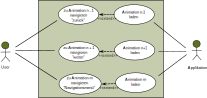

# Pflichtenheft
#####  (Nach Ludewig und Lichter, 351-358)

| Version | Autor | Quelle | Status | Datum | Kommentar |
| ------- | ----- | ------ | ------ | ----- | --------- |
|  0.1    |  Georg Fischer   | lastenheft.md | in Bearbeitung  | 19.03.2024 | Datei erstellt |
|  0.2    |  Georg Fischer   | lastenheft.md | in Bearbeitung  | 20.03.2024 | Pkt. 1.1 - 1.3 bearbeitet |
|  0.3    |  Georg Fischer   | lastenheft.md | in Bearbeitung  | 21.03.2024 | Pkt. 1.4 - 2.5 (ausgenommen 2.2) bearbeitet |
|  0.4    |  Georg Fischer   | lastenheft.md | in Bearbeitung  | 22.03.2024 | Pkt. 2.2 bearbeitet |
|  0.5    |  Georg Fischer   | lastenheft.md | in Bearbeitung  | 23.03.2024 | Use-case 1 (Anhang) hinzugefügt |
|  0.6    |  Georg Fischer   | lastenheft.md | in Bearbeitung  | 10.04.2024 | Use-case 2 bis 7 (Anhang) hinzugefügt |
|  0.7    |  Georg Fischer   | lastenheft.md | in Bearbeitung  | 11.04.2024 | Pkt. 4 bearbeitet, Pkt. 3 begonnen |
|  0.8    |  Georg Fischer   | lastenheft.md | in Bearbeitung  | 12.04.2024 | Pkt. 3 bearbeitet, Use-case 8 bis 12 (Anhang) hinzugefügt |
|  0.9    |  Georg Fischer   | lastenheft.md | in Bearbeitung  | 13.04.2024 | Use-case 13 (Anhang) hinzugefügt |

## 1. Einleitung

### 1.1 Zweck

Der **Zweck** dieses Pflichtenhefts ist es, die Anforderungen, die sich aus dem Lastenheft ergeben, aus der Sicht des
Programmierers zu präzisieren, Anwendungsfälle ("Use-cases") inklusive etwaiger Ausnahmen und Sonderfälle zu 
definieren, sodass darauf aufbauend das Design der Applikation erstellt und die technischen Spezifikationen
vorgenommen werden können. Der **Leserkreis** eines Pflichtenhefts wäre im Regelfall der Auftraggeber, im konkreten 
Spezialfall dieses Projekts ist es der Autor (Programmierer) selbst.

### 1.2 Einsatzbereich und Ziele

Der **vorrangige Einsatzbereich** der Applikation soll der Informatikunterricht an der gymnasialen 
Oberstufe sein. Die **Ziele** sind, dass Lernenden ohne Vorwissen die fundamentalen Konzepte einer Blockchain 
vermittelt werden und es dabei für die Lernenden die Möglichkeit gibt, an bestimmten Stellen interaktiv einzugreifen. 
Die **Vision** hinter diesen Zielen ist, dass durch die Anwendung der Applikation die fundamentalen Konzepte einer 
Blockchein schneller und effizienter verstanden und gelernt werden können. Daher ist es ein weiteres Ziel, dass die
Applikation optisch ansprechend gestaltet ist.

Ein **weiterer Einsatzbereich** ist die selbstständige Anwendung der Applikation durch User ausserhalb des Unterrichts,
ohne formellen Rahmen und ohne vermittelnde Lehrperson. Daher ist es ein weiteres **Ziel**, dass die Applikation
selbsterklärend und intuitiv bedienbar ist.

Was die Applikation **nicht leisten** kann, ist, dass den Lernenden sämtliche Konzepte einer Blockchain detailliert und
vollständig vermittelt werden. Sie werden nach der Anwendung nicht in der Lage sein, selbst eine Blockchain-Anwendung zu
programmieren, es geht auch nicht darum, Wissen oder Kompetenzen zu erlangen, wie man eine konkrete existierende
Blockchain-Anwendung (z.B. die Bitcoin-Blockchain) verwendet, d.h. welche Software dafür installiert und wie diese
bedient werden muss.

### 1.3 Definitionen

| **Begriff** | **Erklärung** |
| ----------- | ------------- |
| Adresse | eine eindeutig identifizierbare, pseudonyme Identität eines Knotens einer Blockchain, bestehend aus dem öffentlichen Schlüssel eines zufällig erzeugten Schlüsselpaars |
| asymmetrische Verschlüsselung | Verschlüsselungsverfahren, bei dem für die Verschlüsselung und die Entschlüsselung zwei unterschiedliche Schlüssel verwendet werden |
| Block | Einheit von Daten in einer Blockchain-Datenstruktur, bestehend aus einem Block-Header und einem Merkle-Tree mit Hash-Referenzen auf die Transaktionsdaten ("Inhalt") |
| Blockchain-Datenstruktur | Organisation von Transaktionsdaten in miteinander verketteten Einheiten ("Blöcken") |
| Block-Header | Kopf eines Blocks einer Blockchain, bestehend (zumindest) aus der Hash-Referenz auf den vorherigen Block-Header, der Wurzel eines Merkle-Trees, dem Schwierigkeitsgrad für das Hashpuzzle ("Target"), einem Zeitstempel und einer Nonce |
| digitale Signatur | ein mit dem privaten Schlüssel verschlüsselter und zusammen mit einer Nachricht verschickter Hashwert der Nachricht, der die Authentifizierung der Nachricht ermöglicht |
| Hash-Referenz | ein Hash-Wert, der auf Daten (z.B. Transaktionsdaten) verweist, die an einem anderen Ort gespeichert sind |
| Hashpuzzle | eine Berechnungsaufgabe, bei der ein Hashwert mit einem bestimmten Target gesucht wird und die nur durch die Trial-and-Error-Methode zu lösen ist, indem den Daten, die gehasht werden, eine sich ständig ändernde Nonce hinzugefügt wird |
| Hashwert | eine Zahl mit fixer Länge, die von einer Hashfunktion bzw. einem Hashalgorithmus aus Daten unterschiedlicher Länge berechnet wird |
| Merkle-Tree | ein Binär-Baum, dessen Blätter Transaktionsdaten enthalten und dessen Knoten erzeugt werden, indem man Hashwerte aus den jeweils darunterliegenden Teilbäumen kombiniert und daraus einen neuen Hashwert generiert; die Wurzel des Baumes ist ebenfalls ein Hashwert |
| Mining | der Versuch, ein Hashpuzzle zu lösen, um einen neuen Block an die Blockchain anfügen zu können; im Erfolgsfall gibt es für die bereitgestellte Rechnerleistung in der Regel eine Entlohnung |
| Nonce | eine einmalige Zahlenfolge ("Number used once"), die einem Block-Header hinzugefügt und dazu benötigt wird, das Hashpuzzle zu lösen |
| Peer-to-Peer System | ein verteiltes Softwaresystem aus Einzelcomputern ("Knoten"), die sich ihre Berechnungsressourcen teilen und bei denen jeder Knoten die gleiche Funktionalität und Verantwortung hat |
| Proof-of-Work | ein Algorithmus, der dazu führt, dass unter den einzelnen Knoten des Peer-to-Peer-Systems ein Konsens über die Gültigkeit eines neuen Blocks gefunden wird, indem die Lösung eines Hashpuzzles als Beweis für die Gültigkeit des Blocks und als Arbeitsnachweis dient |
| Schlüsselpaar | in einem asymmetrischen Verschlüsselungsverfahren ein Paar aus einem öffentlichen und einem privaten Schlüssel |
| SiC (= Simulation Coin) | eine eigens für die Webapplikation erfundene fiktive Kryptowährung|
| Target | der Schwierigkeitsgrad eines Hashpuzzles, angegeben durch eine Zahl; der gesuchte Hashwert (die Zahl, die das Hashpuzzle löst) muss kleiner sein als diese Zahl |
| Transaktion | Übertragung von Werten innerhalb einer Blockchain von einer Adresse zu einer anderen Adresse |
| User | jede Person, welche die Applikation anwendet, gleichgültig in welchem Einsatzbereich | 

### 1.4 Referenzierte Dokumente

Das **Lastenheft** mit den Anforderungen an die Applikation aus der Sicht des Auftraggebers.

### 1.5 Überblick

* In **Pkt. 2** dieses Pflichtenhefts wird die Applikation allgemein beschrieben.
* In **Pkt. 3** werden die im Lastenheft formulierten Anforderungen detailliert aufgelistet. Unterstützend dafür finden
sich im Anhang skizzierte und beschriebene Use-cases.
* **Pkt. 4** ist aufgrund der speziellen Situation, dass es sich um das "individuelle Projekt" im Rahmen des 
Studienprogramms GymInf handelt und es keinen Auftraggeber im eigentlichen Sinn gibt, der am Ende das fertige
Produkt abnimmt, verhältnismässig kurz gehalten.
* Im **Anhang** finden sich die Use-cases, die sich aus dem Lastenheft (/LK10/ bis /LK80/ sowie /LF10/ bis /LF40/
und /LQF10/ bis /LQE10/) ergeben.

## 2. Allgemeine Beschreibung

### 2.1 Einbettung

* Die Applikation steht für sich selbst, ist nicht Teil einer grösseren Anwendung und auch nicht von anderen Anwendungen
  abhängig.
* Die Realisierung erfolgt als Web-Applikation, für die Umsetzung werden HTML, CSS und JavaScript verwendet.
* Die Ausführung der Applikation sowie der eingebetteten Skripte erfolgt auf der Client-Seite.

### 2.2 Funktionen

* Die Applikation besteht aus einer Anzahl von animierten Grafiken, über die a) durch das Klicken von "weiter"- und
  "zurück"-Buttons navigiert werden kann oder die b) über ein Navigationsmenü direkt angesteuert werden können.
* Alle animierten Grafiken können vom User durch das Klicken von Buttons gestartet oder abgebrochen, gegebenenfalls
  unterbrochen und wieder fortgesetzt werden.
* Bei allen animierten Grafiken gibt es (vor dem Start und/oder nach Beendigung bzw. Abbruch der Animation) die Möglichkeit,
  dass durch das Klicken auf ein intuitiv verständliches Symbol erklärende Texte aufpoppen. Dabei wird optisch unterschieden
  zwischen Erklärungen, die sich direkt auf das in der Animation Gezeigte beziehen, und weiterführenden Texten, die über das
  in der Animation Gezeigte hinausgehen.
* Bei bestimmten Animationen gibt es für den User die Möglichkeit, durch (Text-)Eingaben über ein Formular die Gestaltung
  der Animationen interaktiv zu beeinflussen, wobei einmal getätigte Eingaben auch Auswirkungen auf die Gestaltung danach
  folgender Animationen haben können.

### 2.3 Benutzerprofile

* **Schülerinnen und Schüler der gymnasialen Oberstufe:** eine informatische Grundbildung, die in der Sekundarstufe
  erfolgt, kann vorausgesetzt werden; es wird davon ausgegangen, dass keine Kenntnisse über Blockchains, Hashfunktionen
  und asymmetrische Verschlüsselungsverfahren vorhanden sind
* **"freie" User:** eine etwaige informatische Vorbildung kann nicht vorausgesetzt werden, trotzdem wird davon
  ausgegangen, dass diese vergleichbar mit jener von Schülerinnen und Schülern der gymnasialen Oberstufe ist

Für alle User gilt die Voraussetzung, dass sie der deutschen Sprache mächtig sind.

### 2.4 Einschränkungen
* Die Applikation soll lediglich in deutscher Sprache zur Verfügung stehen, es sind keine Übersetzungen geplant.
* Es ist möglich, dass einige Animationen so gross werden, dass sie auf einem kleinen, hochformatigen Bildschirm (z.B.
  Smartphone) nicht zur Gänze darstellbar sind.
* Das "individuelle Projekt" im Studienprogramm GymInf dient dazu, dass Studierenden ihre im Studium erworbenen Kenntnisse
  in die Praxis umsetzen. Daher versucht der Autor (Programmierer), soweit das möglich ist, den notwendigen Code
  eigenhändig zu schreiben und auf Bibliotheken, Templates, APIs, ... weitestgehend zu verzichten. Es ergibt sich von
  selbst, dass das zu einer Einschränkung in der Qualität der Applikation führt.

### 2.5 Annahmen und Abhängigkeiten
* Angenommen wird, dass die User moderne Browser verwenden, die HTML5, CSS3 und JavaScript beherrschen.
* Bei der Konzeption der Animationen wird angenommen, dass die User die Applikation mehrheitlich auf grösseren,
  querformatigen Bildschirmen anwenden.
* Es bestehen keine Abhängigkeiten zu anderen Systemen oder anderer Software.

## 3. Einzelanforderungen

* **/F10/** Das Design der Webapplikation *muss* responsiv sein. *(vgl. /LQB10/)*
  * /F11/ Bei einer Bildschirmbreite von weniger als 960 Pixeln *soll* das bei grösseren Bildschirmbreiten angezeigte
    Navigationsmenü verschwinden und über ein "Hamburger-Menü-Icon" ausklappbar sein.
  * /F12/ Die aufpoppenden erklärenden bzw. weiterführenden Texte *müssen* bei einer Bildschirmbreite von mindestens
    540 Pixeln ohne horizontales Scrollen lesbar sein. *(vgl. Use-case 3)*
  * /F13/ Die verwendeten Schriftarten sollen bei einer Bildschirmbreite von weniger als 960 Pixeln um 25 - 35 Prozent
    kleiner werden.
  * /F14/ Die Grösse der Animationen *sollte sich eventuell* dynamisch an die Bildschirmbreite anpassen.
* **/F20/** Die Applikation *muss* dem User die Möglichkeit geben, die Animationen selbstständig zu starten, abzubrechen,
  zu unterbrechen und nach einer Unterbrechung fortzusetzen. *(vgl. Use-case 1, /LF10/)*
  * /F21/ Bei jeder Animation *muss* der User durch das Klicken jeweils eines Buttons die Animation starten und abbrechen
    können.
  * /F22/ Bei jenen Animationen, die länger als 3 Sekunden dauern, *muss* der User durch das Klicken jeweils eines Buttons
    die Animation unterbrechen und nach einer Unterbrechung fortsetzen können.
* **/F30/** Eine einfache Navigation über die einzelnen Animationen *soll* in der gesamten Applikation mittels eines Menüs
  und mithilfe von Buttons ermöglicht werden. *(vgl. Use-case 2, /LF20/, /LQB30/)*
  * /F31/ Die Applikation *muss* dem User die Möglichkeit geben, über "weiter"- und "zurück"-Buttons zwischen den
    einzelnen Animationen nach vor und zurück zu springen.
  * /F31/ Die Applikation *muss* dem User die Möglichkeit geben, über ein eigenes Navigationsmenü direkt zu den einzelnen
    Animationen zu navigieren.
* **/F40/** Die Applikation *muss* dem User die Möglichkeit geben, durch das Klicken auf ein Symbol oder einen Button
  erklärende und/oder weiterführende Texte zu den einzelnen Animationen zu öffnen. *(vgl. Use-case 3, /LF30/)*
  * /F41/ Die erklärenden Texte *sollen* durch das Klicken auf ein intuitiv verständliches Symbol (z.B. i in einem Kreis),
    das sich an einer oder mehreren Stellen im Bereich einer Animation befindet, aufpoppen. *(vgl. /LQB20/)*
  * /F42/ Die weiterführenden Texte *sollen* durch das Klicken auf einen Button (z.B. "Hintergrundwissen"), der sich
    unterhalb der Animation befindet, aufpoppen.
  * /F43/ Die erklärenden und die weiterführenden Texte sollen sich farblich unterscheiden. *(vgl. /LBQ40/)*
  * /F44/ Die erklärenden Texte *sollen* leicht verständlich geschrieben und ausgewogen bezüglich Kürze und inhaltlicher
    Tiefe sein. *(vgl. /LQE10/)*
* **/F50/** Die Applikation *soll* dem User die Möglichkeit geben, interaktiv in die Gestaltung von Animation 1
  ("Aufbau einer Blockchain-Datenstruktur") einzugreifen. *(vgl. /LF40/, /LF41/)*
  * /F51/ Die Animationen 1a, 1b und 1c *sollen* schrittweise detaillierter zeigen, wie einer Blockchain neue Blöcke
    hinzugefügt werden, wobei die Inhalte dieser neuen Blöcke die vom User eingegebenen Texte sind. *(vgl. Use-case 4
    bis Use-case 5)*
  * /F52/ Der User soll die Möglichkeit haben, bei Animation 1a einen kurzen Text (maximal ca. 50 Zeichen, bestehend aus
    ausschliesslich Gross- und Kleinbuchstaben, Umlauten und Ziffern) einzugeben, bei Animation 1b und 1c einen ebensolchen
    kurzen Text einzugeben und die Berechnung eines Hashwerts durch das Klicken eines Buttons zu starten. *(vgl. Use-case
    4 bis Use-case 6)*
  * /F53/ Die ausgegebenen Hashwerte *sollen* das Ergebnis einer Hashfunktion und demgemäss vom eingegebenen Text
    abhängig sein.
  * /F54/ Die Animation 1d *soll* zeigen, wie Block-Header und Inhalt getrennt und durch eine Hash-Referenz im
    Block-Header miteinander verknüpft werden. *(vgl. Use-case 7)*
* **/F60/** Die Applikation *soll* dem User die Möglichkeit geben, interaktiv in die Gestaltung von Animation 2
  ("Hinzufügen eines neuen Knotens zu einem Peer-to-Peer-System") einzugreifen. *(vgl. /LF40/, /LF42/)*
  * /F61/ Die Animationen 2a und 2b *sollen* zeigen, wie ein neuer Knoten zu einem als ungerichteter Graph modellierten
    Peer-to-Peer-System hinzugefügt wird und wie für diesen Knoten ein Wallet mit einem oder mehreren Schlüsselpaaren
    ("Adressen") eingerichtet wird, wobei der User dem Knoten einen vorläufigen Namen zuweisenn und die Anzahl der
    Adressen bestimmen kann. *(vgl. Use-case 8 und Use-case 9)*
  * /F62/ Der User *soll* die Möglichkeit haben, bei Animation 2a einen Namen (maximal 20 Zeichen, bestehend aus
    ausschliesslich Gross- und Kleinbuchstaben, Umlauten und Ziffern) einzugeben. *(vgl. Use-case 8)*
  * /F63/ Der User *soll* die Möglichkeit haben, bei Animation 2b die Anzahl der dem neuen Knoten zugewiesenen Adressen
    (mindestens 1, maximal 3 Adressen) einzugeben. *(vgl. Use-case 9)*
  * /F64/ Die Zuweisung der vorläufigen Namen der Knoten in Animation 2a sowie der Anzahl der Adressen als auch der
    Adressen selbst in Animation 2b *soll* bei jedem Start der Applikation aus einer vorgegebenen Auswahl (ca. 200 Namen
    und ca. 200 Adressen, Anzahl von 1 bis 3) zufällig gewählt werden.
  * /F65/ Die Animation 2c soll zeigen, wie die Namen der Knoten verschwinden und als pseudonyme Identifikation
    ausschliesslich die Adressen übrig bleiben. *(vgl. Use-case 10)*

## 4. Abnahmekriterien

* /A10/ Das Design der Webapplikation ist responsiv, auch bei der Benutzung auf einem Smartphone ist eine gegebenenfalls
  leicht eingeschränkte Übersichtlichkeit gegeben.
* /A20/ Es ist möglich, über "weiter"- und zurück"-Buttons zwischen den einzelnen Animationen nach vor und zurück zu
  springen sowie über ein eigenes Navigationsmenü direkt zu den einzelnen Animationen zu navigieren.
* /A30/ Es ist bei allen Animationen möglich, die jeweilige Animation zu starten und jederzeit abzubrechen.
* /A31/ Es ist bei jenen Animationen, die länger als 3 Sekunden dauern, möglich, die jeweilige Animation beliebig oft zu
  unterbrechen und danach wieder fortzusetzen.
* /A40/ Es ist bei allen Animationen möglich, durch das Klicken auf ein Symbol oder einen Button erklärende und/oder
  weiterführende Texte zu öffnen.
* /A50/ Die Applikation erfüllt die in Pkt. 3 ("Einzelanforderungen") zu den einzelnen Animationen definierten
  funktionalen Anforderungen /F50/ bis **/Fxx/**, wobei etwaige kleine Abstriche möglich sind, jedoch jeder konkrete
  Einzelfall gesondert bewertet werden muss.
* /A60/ Die optische Gestaltung der Applikation ist mehrfarbig, das für das Verständnis der fundamentalen Konzepte einer
  Blockchain Wesentliche ist erkennbar hervorgehoben.
* /A70/ Die erklärenden und weiterführenden Texte sind für den Grossteil junger Lernender mit wenig Erfahrung und geringen
  Kenntnissen in der Informatik verständlich geschrieben und ausgewogen bezüglich notwendiger Kürze und wünschenswerter
  Tiefe.

# Anhang

## Anhang A. Use-cases

### Use-case 1 - gilt für alle Animationen:

* Name: *Animation n starten / unterbrechen / fortsetzen / abbrechen*
* Akteur: *User*
* Vorbedingungen: *Der User hat zu einer Animation navigiert, die Animation ist vollständig geladen.*
* Standardablauf:
    * Der User startet die Animation n.
      * (Optional, mehrfach möglich: Der User unterbricht die Animation.)
      * (Optional, nur nach Unterbrechen der Animation möglich: Der User setzt die Animation fort.)
      * (Optional: der User bricht die Animation ab.)
    * Die Animation ist beendet.
* Nachbedingung Erfolg: *Der letzte Frame der Animation wird am Bildschirm angezeigt.*
* Nachbedingung Sonderfall 1a: *Die vom User gewählte Animation wird geladen.*

#### Sonderfall 1a: Der User navigiert von der Animation weg.
* Ablauf Sonderfall 1a:
    * Der User betätigt die "weiter"- oder "zurück"-Buttons oder wählt eine Animation im Navigationsmenü.
    * Der User navigiert zur nachfolgenden ODER zur vorherigen ODER zu einer beliebigen Animation.

### Use-case 2 - gilt für alle Animationen:

* Name: *Navigation zwischen den einzelnen Animationen*
* Akteure: *User*
* Vorbedingungen: *Der User hat zu einer beliebigen Animation n navigiert.*
* Standardablauf:
    * Der User navigiert zur vorherigen Animation n-1 durch Klicken auf einen "Zurück"-Button
    * ODER: Der User navigiert zur nachfolgenden Animation n+1 durch Klichen auf einen "Weiter"-Button
    * ODER: Der User navigiert zu eienr beliebigen Animation m durch das Klicken auf einen Link zur
      Animation m im Navigationsmenü.
* Nachbedingung Erfolg: *Die gewählte Animation wird geladen.*
* Nachbedingung Sonderfall 2a: *Die erste Animation wird geladen.*
* Nachbedingung Sonderfall 2b: *Die letzte Animation wird geladen.*

#### Sonderfall 2a: Der User hat zur ersten Animation navigiert und klickt auf den "Zurück"-Button
* Ablauf Sonderfall 2a;
    * Der User klickt auf den "Zurück"-Button.
    * Eine Benachrichtigung erscheint auf dem Bildschirm mit folgendem Text: "Sie befinden sich bereits
      bei der ersten Animation."

#### Sonderfall 2b: Der User hat zur letzten Animation navigiert und klickt auf den "Weiter"-Button
* Ablauf Sonderfall 2b:
    * Der User klickt auf den "Weiter"-Button.
    * Eine Benachrichtigung erscheint auf dem Bildschirm mit folgendem Text: "Sie befinden sich bereits
      bei der letzten Animation."

### Use-case 3 - gilt für alle Animationen:

* Name: *Erklärende und/oder weiterführende Texte zu den Animationen öffnen*
* Akteure: *User*
* Vorbedingungen: *Eine Animation ist vollständig geladen, aber noch nicht gestartet ODER eine
  Animation ist beendet. Im Bereich der Animation befinden sich an einer oder mehreren Stellen ein
  oder mehrere Symbole, die intuitiv als Buttons für erklärende Informationen zu den Animationen
  verstanden werden können. Unterhalb der Animationen befindet sich ein Button, der mit dem Text
  "Hintergrundwissen" beschriftet ist.*
* Standardablauf:
    * Der User klickt auf eines der angezeigten Symbole im Bereich der Animation
    * ODER: Der User klickt auf den "Hintergrundwissen"-Butten unterhalb der Animation
    * Ein erklärender bzw. weiterführender Text poppt auf, der sich optisch unterscheidet je
      nachdem, ob es sich um eine erklärende Information (Symbol) oder um weiterführende
      Informationen (Button "Hintergrundwissen") handelt.
    * Der User klickt irgendwo innerhalb der Applikation.
    * Der erklärende bzw. weiterführende Text verschwindet.
* Nachbedingung Erfolg: *Die Applikation befindet sich im gleichen Status wie vor dem Öffnen der
  erklärenden oder weiterführenden Texte.*

### Use-case 4 - Animation 1a:

* Name: *Aufbau einer Blockchain-Datenstruktur, Teil 1/4*
* Akteure: *User, Applikation*
* Vorbedingungen: *Animation 1a ist geladen. Der erste Frame zeigt zwei symbolisch dargestellte
  Seiten eines Buchs, bestehend jeweils aus einer Seitenzahl ("Seite 1", "Seite 2") und einem 
  kurzen Text als Inhalt (siehe folgende schematische Darstellung).*

* Standardablauf:
    * Der User startet die Animation, indem er auf einen Button, der mit "Erstelle eine neue Seite"
      beschriftet ist, klickt.
    * Es öffnet sich ein Formular, in das der User einen kurzen Text als Inhalt für eine neue Seite
      eingibt. Die Seitenzahl ("Seite 3") wird automatisch zugewiesen. Der User bestätigt mit "OK".
    * Eine neue symbolisch dargestellte Seite eines Buchs, bestehend aus einer Seitenzahl ("Seite
      3") und dem vom User eingegebenen Inhalt wird der Animation hinzugefügt.
    * Animation 1a ist beendet.
* Nachbedingung Erfolg: *Eine neue symbolisch dargestellte Seite eines Buchs mit dem vom User
  eingegebenen Ihhalt ist der Animation hinzugefügt (siehe folgende schematische Darstellung).*
* Nachbedingung Sonderfall 4a: *Animation 1a wird neu geladen.*
 

#### Sonderfall 4a: Der User gibt einen Text ein, der länger als 50 Zeichen ist oder nicht ausschliesslich Gross- und Kleinbuchstaben, Umlauten und Ziffern besteht
* Ablauf Sonderfall 4a:
    * Der User klickt auf "OK".
    * Eine Benachrichtigung erscheint auf dem Bildschirm mit folgendem Text: "Bitte geben Sie einen Text ein, der
      ausschliesslich aus Gross- und Kleinbuchstaben oder Ziffern besteht und maximal 50 Zeichen lang ist."

### Use-case 5 - Animation 1b:

* Name: *Aufbau einer Blockchain-Datenstruktur, Teil 2/4*
* Akteure: *User, Applikation*
* Vorbedingungen: *Animation 1b ist geladen. Der erste Frame zeigt drei symbolisch dargestellte
  Seiten eines Buchs, bestehend jeweils aus einem auf den Inhalt berechneten Hashwert (eine
  achtstellige hexadezimale Zahl) und einem kurzen Text als Inhalt. Die Texte sind identisch mit
  jenen aus Animation 1a, auf der dritten Seite befindet sich also der vom User in Animation 1a
  eingegebene Text (siehe folgende schematische Darstellung).*

* Standardablauf:
    * Der User startet die Animation, indem er auf einen Button, der mit "Erstelle eine neue Seite"
      beschriftet ist, klickt.
    * Es öffnet sich ein Formular, in das der User einen kurzen Text als Inhalt für eine neue Seite
      eingibt. 
    * Durch Klicken eines Buttons ("Hashwert berechnen") wird auf den vom User eingegebenen Text
      ein Hashwert berechnet. Der User bestätigt mit "OK".
    * Eine neue symbolisch dargestellte Seite eines Buchs, bestehend aus dem berechneten Hashwert
      und dem vom User eingegebenen Inhalt wird der Animation hinzugefügt.
    * Animation 1b ist beendet.
* Nachbedingung Erfolg: *Eine neue symbolisch dargestellte Seite eines Buchs mit dem vom User
  eingegebenen Ihhalt und dem auf diesen Inhalt berechneten Hashwert ist der Animation hinzugefügt
  (siehe folgende schematische Darstellung).*
* Nachbedingung Sonderfall 5a: *Animation 1b wird neu geladen.*
 

#### Sonderfall 5a: Der User gibt einen Text ein, der länger als 50 Zeichen ist oder nicht ausschliesslich Gross- und Kleinbuchstaben, Umlauten und Ziffern besteht
* Ablauf Sonderfall 5a:
    * Der User klickt auf "OK".
    * Eine Benachrichtigung erscheint auf dem Bildschirm mit folgendem Text: "Bitte geben Sie einen Text ein, der
      ausschliesslich aus Gross- und Kleinbuchstaben oder Ziffern besteht und maximal 50 Zeichen lang ist."

### Use-case 6 - Animation 1c:

* Name: *Aufbau einer Blockchain-Datenstruktur, Teil 3/4*
* Akteure: *User, Applikation*
* Vorbedingungen: *Animation 1c ist geladen. Der erste Frame zeigt vier symbolisch dargestellte
  Blöcke einer Blockchain, bestehend jeweils aus einem auf den Inhalt berechneten Hashwert, einer
  Hash-Referenz auf den vorherigen Block und einem kurzen Text als Inhalt. Die Texte sind identisch
  mit jenen aus Animation 1b, auf der dritten und der vierten Seite befinden sich also die vom
  User in den Animation 1a und 1b eingegebenen Texte (siehe folgende schematische Darstellung).*

* Standardablauf:
    * Der User startet die Animation, indem er auf einen Button, der mit "Erstelle eine neue Seite"
      beschriftet ist, klickt.
    * Es öffnet sich ein Formular, in das der User einen kurzen Text als Inhalt für einen neuen
      Block eingibt. 
    * Durch Klicken eines Buttons ("Hashwert berechnen") wird auf den vom User eingegebenen Text
      ein Hashwert berechnet. Die Hash-Referenz auf den vorherigen Block wird automatisch zugewiesen.
      Der User bestätigt mit "OK".
    * Eine neuer symbolisch dargestellter Block einer Blockchain, bestehend aus dem berechneten
      Hashwert, der Hash-Referenz auf den vorherigen Block und dem vom User eingegebenen Inhalt wird
      der Animation hinzugefügt.
    * Animation 1c ist beendet.
* Nachbedingung Erfolg: *Ein neuer symbolisch dargestellter Block einer Blockchain mit dem vom
  User eingegebenen Ihhalt, dem auf diesen Inhalt berechneten Hashwert und einer Hash-Referenz auf
  den vorherigen Block ist der Animation hinzugefügt (siehe folgende schematische Darstellung).*
* Nachbedingung Sonderfall 6a: *Animation 1c wird neu geladen.*
 

#### Sonderfall 6a: Der User gibt einen Text ein, der länger als 50 Zeichen ist oder nicht ausschliesslich Gross- und Kleinbuchstaben, Umlauten und Ziffern besteht
* Ablauf Sonderfall 6a:
    * Der User klickt auf "OK".
    * Eine Benachrichtigung erscheint auf dem Bildschirm mit folgendem Text: "Bitte geben Sie einen Text ein, der
      ausschliesslich aus Gross- und Kleinbuchstaben oder Ziffern besteht und maximal 50 Zeichen lang ist."

### Use-case 7 - Animation 1d:

* Name: *Aufbau einer Blockchain-Datenstruktur, Teil 4/4*
* Akteure: *User, Applikation*
* Vorbedingungen: *Animation 1d ist geladen. Der erste Frame zeigt fünf symbolisch dargestellte
  Blöcke einer Blockchain, bestehend jeweils aus einem auf den Inhalt berechneten Hashwert, einer
  Hash-Referenz auf den vorherigen Block und einem kurzen Text als Inhalt. Der Frame ist identisch
  mit dem Abschluss-Frame aus Animation 1c, auf der dritten, vierten und fünften Seite befinden
  sich also die vom User in den Animation 1a, 1b und 1c eingegebenen Texte.*
* Standardablauf:
    * Der User startet die Animation, indem er auf einen Button, der mit "Starte Animation"
      beschriftet ist, klickt.
    * In einer Animation wird aus den fünf symbolisch dargestellten Blöcken deren jeweiliger Inhalt
      ausgelagert und durch eine Hash-Referenz auf diesen ersetzt. Übrig bleibt ein Block-Header.
    * Animation 1d ist beendet.
* Nachbedingungen Erfolg: *Die fünf symbolisch dargestellten Blöcke einer Blockchain sind in der
  Animation aufgeteilt in Block-Header und die jeweiligen Inahlte, auf die in den Block-Headern
  referenziert wird (siehe folgende schematische Darstellung).*
 

### Use-case 8 - Animation 2a:

* Name: *Hinzufügen eines neuen Knotens zu einem Peer-to-Peer-System", Teil 1/3*
* Akteure: *User, Applikation*
* Vorbedingungen: *Animation 2a ist geladen. Der erste Frame zeigt einen ungerichteten Graphen mit elf Knoten, jeder
  beschriftet mit einem kurzen Vornamen (siehe folgende schematische Darstellung).*

* Standardablauf:
    * Der User startet die Animation, indem er auf einen Button, der mit "Erstelle einen neuen Peer" beschriftet ist,
      klickt.
    * Es öffnet sich ein Formular, in das der User einen kurzen Text als Name für eine neuen Peer eingibt. Der User
      bestätigt mit "OK".
    * Ein neuer Knoten, der mit dem eingegebenen Namen beschriftet ist, wird dem ungerichteten Graphen hinzugefügt. Der
      neue Knoten ist mit zwei anderen Knoten verbunden.
    * Animation 2a ist beendet.
* Nachbedingung Erfolg: *Ein neuer, mit dem vom User eingegebenen Namen beschrifteter Knoten ist dem Peer-to-Peer-System
  hinzugefügt (siehe folgende schematische Darstellung.)*
* Nachbedingung Sonderfall 8a: *Animation 2a wird neu geladen.*

#### Sonderfall 8a: Der User gibt einen Text ein, der länger als 20 Zeichen ist oder nicht ausschliesslich Gross- und Kleinbuchstaben, Umlauten und Ziffern besteht
* Ablauf Sonderfall 8a:
    * Der User klickt auf "OK".
    * Eine Benachrichtigung erscheint auf dem Bildschirm mit folgendem Text: "Bitte geben Sie einen Text ein, der
      ausschliesslich aus Gross- und Kleinbuchstaben oder Ziffern besteht und maximal 20 Zeichen lang ist."

### Use-case 9 - Animation 2b:

* Name: *Hinzufügen eines neuen Knotens zu einem Peer-to-Peer-System", Teil 2/3*
* Akteure: *User, Applikation*
* Vorbedingungen: *Animation 2b ist geladen. Der erste Frame zeigt den Graphen aus Animation 2a, allerdings so verändert,
  dass die Beschriftung jedes Knotens ausgenommen des vom User in Animation 2a hinzugefügten mit einer, zwei oder drei
  Adressen erweitert worden ist (siehe folgende schematische Darstellung.)*

* Standardablauf:
    * Der User startet die Animation, indem er auf einen Button, der mit "Erstelle ein Wallet" beschriftet ist, klickt.
    * Es öffnet sich ein Formular, in das der User eine ganze Zahl von 1 bis 3 als Anzahl für die einzurichtenden
      Adressen eingibt. Der User bestätigt mit "OK".
    * Die Beschriftung des vom User in Animation 2a hinzugefügten Knoten wird mit so vielen Adressen erweitert, wie der
      es eingegeben hat.
    * Animation 2b ist beendet.
* Nachbedingung Erfolg: *Die Beschriftung des vom User in Animation 2a hinzugefügten Knoten ist mit so viele Adressen
  erweitert, wie es der User eingegeben hat. Neben diesem Knoten befindet sich ein Textfeld mit den entsprechenden
  privaten Schlüsseln (siehe folgende schematische Darstellung.)*
* Nachbedingung Sonderfall 9a: *Animation 2b wird neu gestartet.*

#### Sonderfall 9a: Der User gibt etwas anderes ein als eine der drei ganzen Zahlen 1, 2, oder 3
* Ablauf Sonderfall 9a:
    * Der User klickt auf "OK".
    * Eine Benachrichtigung erscheint auf dem Bildschirm mit folgendem Text: "Bitte geben Sie eine ganze Zahl von 1
      bis 3 ein."

### Use-case 10 - Animation 2c:

* Name: *Hinzufügen eines neuen Knotens zu einem Peer-to-Peer-System", Teil 3/3*
* Akteure: *User, Applikation*
* Vorbedingungen: *Animation 2c ist geladen. Der erste Frame ist identisch mit dem Abschluss-Frame von Animation 2b
  und zeigt den ungerichteten Graphen mit allen Namen und Adressen, einschliesslich dem vom User in Animation 2a
  eingegebenen Namen und den in Animation 2b hinzugefügten Adressen und privaten Schlüsseln.*
* Standardablauf:
    * Der User startet die Animation, indem er auf einen Button, der mit "Starte Animation"
      beschriftet ist, klickt.
    * In einer Animation verschwinden aus den zwölf Knoten hintereinander die jeweiligen Namen, sodass einzig die
      Adressen sowie die privaten Schlüssel der Adressen des vom User in Animation 2a hinzugefügten Knoten übrig bleiben.
    * Animation 2c ist beendet.
* Nachbedingung Erfolg: *Zu sehen ist ein ungerichteter Graph mit zwölf Knoten, die mit ein bis drei Adressen beschriftet
  sind, sowie die privaten Schlüssel der Adressen des vom User hinzugefügten Knotens (siehe folgende schematische
  Darstellung).*

### Use-case 11 - Animation 3a:

* Name: *Durchführen einer Transaktion Teil 1/4*
* Akteure: *User, Applikation*
* Vorbedingungen: *Animation 3a ist geladen. Der erste Frame zeigt eine Tabelle mit den 1 bis 3 Adressen des in
  Animation 2a bis 2c neu hinzugefügten Knotens ODER, falls der User die Animationen 2a bis 2c nicht bearbeitet hat
  und direkt zu Animation 3a navigiert ist, drei aus einer vorgegebenen Auswahl zufällig ausgewählte Adressen. In einer
  weiteren Spalte sind die privaten Schlüssel, eine weitere mit "Kontostand" überschriebene Spalte ist noch leer (siehe
  folgende schematische Darstellung).*

* Standardablauf:
    * Der User startet die Animation, indem er auf einen Button, der mit "Lege Kontostand fest" beschriftet ist, klickt.
    * Es öffnet sich ein Formular, in das der User ein- bis dreimal, je nach Anzahl der Adressen, eine ganze Zahl von 0
      bis 999 eingibt. Der User bestätigt mit "OK".
    * Die vom User eingegebenen Kontostände in der Kryptowährung SiC werden in die Spalte "Kontostand" in die Animation
      eingefügt.
    * Animation 3a ist beendet.
* Nachbedingung Erfolg: *Die Tabelle auf der Animation ist mit den eingegebenen Kontoständen vollständig ausgefüllt.
  (siehe folgende schematische Darstellung).*
* Nachbedingung Sonderfall 11a: *Animation 3a wird neu gestartet.*

#### Sonderfall 11a: Der User gibt etwas anderes ein als eine ganze Zahl von 0 bis 999
* Ablauf Sonderfall 11a:
    * Der User klickt auf "OK".
    * Eine Benachrichtigung erscheint auf dem Bildschirm mit folgendem Text: "Bitte geben Sie eine ganze Zahl von 0
      bis 999 ein."

### Use-case 12 - Animation 3b:

* Name: *Durchführen einer Transaktion Teil 2/4*
* Akteure: *User, Applikation*
* Vorbedingungen: *Animation 3b ist geladen. Der erste Frame zeigt die Tabelle des Abschluss-Frames von Animation 3a
  ODER, falls der User die Animation 3a nicht bearbeitet hat und direkt zu Animation 3b navigiert ist, drei aus einer
  vorgegebenen Auswahl zufällig ausgewählte Adressen mit zufällig bestimmten Kontoständen. Zusätzlich zu dieser Tabelle
  ist eine Tabelle mit allen anderen Adressen des Graphen aus Animation 2c und zufällig bestimmten Kontoständen (siehe
  folgende schematische Darstellung).*

* Standardablauf:
    * Der User startet die Animation, indem er auf einen Button, der mit "Erstelle eine Transaktion" beschriftet ist,
      klickt.
    * Es öffnet sich ein Formular, in dem der User eine seiner eigenen Adressen als Auftraggeber-Adresse und eine von
      allen anderen Adressen als Empfänger-Adresse auswählt und einen zu überweisenden Betrag eingibt. Der User bestätigt
      mit dem Klicken auf einen Button, der mit "Transaktion bestätigen" beschriftet ist.
    * Es öffnet sich ein weiteres Formular, in das automatisch die Transaktionsgebühr, ein akuteller Zeitstempel und ein
      berechneter Hashwert für die ganze Transaktion eingefügt wird. Der User bestätigt die Transaktion mit "OK".
    * Animation 3b ist beendet.
* Nachbedingung Erfolg: *Zusätzlich zu der Tabelle mit den Adressen, privaten Schlüsseln und Kontoständen des Users und
  der Tabelle mit allen anderen Adressen und Kontoständen wird eine neue Tabelle mit allen eingegebenen Transaktionsdaten
  angezeigt (siehe folgende schematische Darstellung).*
* Nachbedingung Sonderfall: *Animation 3b wird neu gestartet.*

#### Sonderfall 12a: Der User gibt als zu überweisenden Betrag keine ganze Zahl ein
* Ablauf Sonderfall 12a:
    * Der User klickt auf "Transaktion bestätigen".
    * Eine Benachrichtigung erscheint auf dem Bildschirm mit folgendem Text: "Bitte geben Sie eine ganze Zahl ein."

### Use-case 13 - Animation 3c:

* Name: *Durchführen einer Transaktion Teil 3/4*
* Akteure: *User, Applikation*
* Vorbedingungen: *Animation 3c ist vollständig geladen. Der erste Frame zeigt die in Animation 3b neu erstellte Tabelle
  mit allen eingegebenen Transaktionsdaten ODER, falls der User direkt zu Animation 3c navigiert ist, mit zufällig
  erstellten Daten, ausgenommen jene, die der User schon irgendwann im Verlaufe der laufenden Verwendung der Applikation
  in einer der Animationen eingegeben hat, und einem noch leeren Feld, das mit "Digitale Signatur" überschrieben ist (siehe
  folgende schematische Darstellung).*

* Standardablauf:
    * Der User startet die Animation, indem er auf einen Butten, der mit "Erstelle eine digitale Signatur" beschriftet
      ist, klickt.
    * In einer Animation wird der Hashwert der Transaktion in Einheiten zu je zwei hexadezimalen Ziffern aufgeteilt. Jede
      dieser zweistelligen hexadezimalen Zahlen wird nacheinander in eine binäre und dann in eine deziamle Zahl umgewandelt.
      Jede dieser dezimalen Zahlen wird nun mit dem privaten Schlüssel der Adresse verschlüsselt, das bedeutet, dass auf
      diese Zahlen eine Berechnung durchgeführt wird. Als Ergebnis bleiben wiederum dezimale Zahlen übrig, die die digitale
      Signatur der Transaktion bilden.
    * Animation 3c ist beendet.
* Nachbedingung Erfolg: *Der letzte Frame der Animation zeigt neben der Tabelle mit den Transaktionsdaten eine neue Tabelle
  mit allen berechneten Zahlen sowie mit der digitalen Signatur als Ergebnis. Die digitale Signatur ist ebenso in der
  Tabelle mit den Transaktionsdaten eingetragen (siehe folgende schematische Darstellung).*

### Use-case 14 - Animation 3d:
* Name: *Durchführen einer Transaktion Teil 4/4*
* Akteure: *User, Applikation*
* Vorbedingungen: *Was muss vor Beginn des Ablaufs gelten*
* Standardablauf:
    * Schritt 1
    * Schritt 2
* Nachbedingung Erfolg: *Was muss nach dem Ende des erfolgreichen Ablaufs gelten*
* Nachbedingung Sonderfall: *Was gilt nach dem Ende, wenn der Ablauf fehlgeschlagen ist*

#### Sonderfall 14a: Ausnahme 1
* Ablauf Sonderfall 14a:
    * Schritt 1
    * Schritt 2

### Use-case 15 - Animation 4a:
* Name: *Speichern von Transaktionen und Erstellen von neuen Blöcken, Teil 1/xxxxxxxxxx*
* Akteure: *User, Applikation*
* Vorbedingungen: *Was muss vor Beginn des Ablaufs gelten*
* Standardablauf:
    * Schritt 1
    * Schritt 2
* Nachbedingung Erfolg: *Was muss nach dem Ende des erfolgreichen Ablaufs gelten*
* Nachbedingung Sonderfall: *Was gilt nach dem Ende, wenn der Ablauf fehlgeschlagen ist*

#### Sonderfall 15a: Ausnahme 1
* Ablauf Sonderfall 15a:
    * Schritt 1
    * Schritt 2
