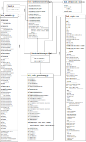
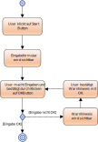

# Technische Dokumentation

| Version | Projektname                       | Autor         | Status         | Datum      | Kommentar |
| ------- | --------------------------------- | ------------- | -------------- | ---------- | --------- |
|   0.1   |  Fundamentale Blockchain-Konzepte | Georg Fischer | in Bearbeitung | 19.04.2024 | Template erstellt |
|   0.2   |  Fundamentale Blockchain-Konzepte | Georg Fischer | in Bearbeitung | 20.04.2024 | Pkt 1.1 bis 1.2 bearbeitet |
|   0.3   |  Fundamentale Blockchain-Konzepte | Georg Fischer | in Bearbeitung | 22.04.2024 | Pkt 2 bis 4 bearbeitet |
|   0.4   |  Fundamentale Blockchain-Konzepte | Georg Fischer | in Bearbeitung | 23.05.2024 | Pkt 5.1 bearbeitet |
|   0.4   |  Fundamentale Blockchain-Konzepte | Georg Fischer | in Bearbeitung | 27.05.2024 | Pkt 5.1 bearbeitet |
|   0.5   |  Fundamentale Blockchain-Konzepte | Georg Fischer | in Bearbeitung | 31.05.2024 | Pkt 5.1 bearbeitet |
|   0.6   |  Fundamentale Blockchain-Konzepte | Georg Fischer | in Bearbeitung | 02.06.2024 | Pkt 5.1 bearbeitet |
|   0.7   |  Fundamentale Blockchain-Konzepte | Georg Fischer | in Bearbeitung | 03.06.2024 | Pkt 5.1 bearbeitet |
|   0.8   |  Fundamentale Blockchain-Konzepte | Georg Fischer | in Bearbeitung | 06.06.2024 | Pkt 5.1 bearbeitet |
|   0.9   |  Fundamentale Blockchain-Konzepte | Georg Fischer | in Bearbeitung | 07.06.2024 | Pkt 5.1 bearbeitet |
|   0.10  |  Fundamentale Blockchain-Konzepte | Georg Fischer | in Bearbeitung | 11.06.2024 | Pkt 5.1 bearbeitet |
|   0.11  |  Fundamentale Blockchain-Konzepte | Georg Fischer | in Bearbeitung | 12.06.2024 | Pkt 5.1 und 5.2 bearbeitet |
|   0.12  |  Fundamentale Blockchain-Konzepte | Georg Fischer | in Bearbeitung | 13.06.2024 | Grafik hinzugefügt |
|   1.0   |  Fundamentale Blockchain-Konzepte | Georg Fischer | abgeschlossen  | 14.06.2024 | Grafiken hinzugefügt |

# 1 Einführung

## 1.1 Zweck 

Das **Ziel** dieses Dokuments ist es, die technische Umsetzung der im Pflichtenheft formulierten Einzelanforderungen (/F10/
bis /F111/) und den dazugehörenden dargestellten Use-cases (Use-case 1 bis Use-case 23) so präzise zu beschreiben, dass
beim Programmieren selbst möglichst keine offenen Fragen mehr bestehen.

Der **Zweck** dieses Dokuments ist,
* einen Überblick über die einzelnen Teile der Applikation sowie deren Interaktion zu schaffen
* festzulegen, wie die Applikation aufgebaut ist und wie zu den verschiedenen Inhalten der Applikation navigiert werden
  kann *(/F30/ bis /F32/)*
* zu klären, wie das responsive Erscheinungsbild der Webapplikation realisiert wird *(/F10/)* und wie die einzelnen
  Anforderungen an das responsive Erscheinungsbild konkret umgesetzt werden *(/F11/ bis /F14/)*
* die technische Umsetzung der einzelnen Animationen und deren Steuerung zu klären *(/F20/ bis /F22/)*
* zu klären, wie das Aufpoppen der erklärenden und weiterführenden Texte zu den Animationen realisiert und optisch
  gestaltet wird *(/F40/ bis /F43/)*
* für die einzelnen Animationen die notwenigen Variablen inklusive deren initialer Belegung sowie die benötigten
  Funktionen zu bestimmen *(/F50/ bis /F111/)*
* zu klären, wie es umgesetzt werden kann, dass einmal gemachte Eingaben und berechnete Werte (z.B. Hashreferenzen) in der
  Applikation verfügbar bleiben, solange sich der User durch die Applikation bewegt *(/LQF10/)*
* die Farben zu bestimmen, die in der Applikation für Texte, Menüs, Symbole, Animationen, Hintergründe verwendet werden
  *(/LQB40/)*
  
Dieses Dokument kann, wenn man es mit dem Bau eines Hauses vergleicht, als "Ausführungsplanung" verstanden werden, also als
ein Plan, der, wenn auch noch nicht jedes kleinste Detail geklärt ist, dennoch schon so ausreichend detailliert ist, dass
mit dem Bau des Hauses begonnen werden kann. Er richtet sich demzufolge in erster Linie an die Ausführenden, bei der
Softwareentwicklung also an die Programmierenden. Im konkreten Spezialfall der Entwicklung dieser Applikation als 
"individuelles Projekt" im Rahmen des Studienprogramms GymInf handelt es sich dabei um den Autor, der in Personalunion 
gleichzeitig Auftraggeber, Designer und Programmierer ist. Ebenso richtet sich dieses Dokument an alle Entwickler*innen, die
gegebenenfalls diese Applikation warten und/oder erweitern möchten, sowie im konkreten Fall auch an alle, die dieses Projekt
zu bewerten und zu beurteilen haben.

## 1.2 Beziehung zu anderen Dokumenten

Dieses Dokument bezieht sich auf die im **Lastenheft** formulierten funktionalen und Qualitätsanforderungen und die im
**Pflichtenheft** formulierten und mit Use-cases detailliert beschriebenen Einzelanforderungen. Ebenso steht dieses 
Dokument in Beziehung zu den einzelnen Dateien, die als **Prototyp** für einzelne Aspekte der Applikation parallel zu diesem
Dokument entwickelt werden.

# 2. Systemübersicht

Die Applikation ist webbasiert und veranschaulicht fundamentale Konzepte der Blockchain-Datenstruktur mithilfe von 
insgesamt sieben Animationen, die aus bis zu vier Teilen bestehen. Bei fünf dieser Animationen ist es für den User 
möglich, interaktiv die Gestaltung der Animationen zu beeinflussen, bei allen Animationen ist es für ihn möglich, den 
Ablauf der Animationen zu steuern *(/LV10/, /F20/ bis /F22/)*. Ebenfalls ist es für den User möglich, zu allen Teilen 
aller Animationen direkt oder über "weiter"- und "zurück"- Buttons zu navigieren *(/F30/bis /F32/)*.

Konkret handelt es sich um folgende sieben Konzepte der Blockchain-Datenstruktur, die jeweils Inhalt der sieben
Animationen sind *(/LK20/ bis /LK80/, /F50/ bis /F111/)*:
* Aufbau einer Blockchain-Datenstruktur
* Hinzufügen eines neuen Knotens zu einem Peer-to-Peer-System
* Durchführung einer Transaktion
* Speichern von Transaktionen und Erstellen von neuen Blöcken
* Schützen der Blöcke durch Proof-of-Work
* Verteilen neuer Transaktionen und Blöcke
* Validieren eines Blocks

Die Applikation bietet dem User vor dem Start und/oder nach Beendigung bzw. Abbruch eines Teils einer Animation die 
Möglichkeit, dass durch das Klicken auf Symbole oder Buttons erklärende oder weiterführende Texte aufpoppen
*(/F40/ bis /F44/)*.

Insgesamt soll die Anwendung der Applikation dazu führen, dass es für Lernende ohne Vorwissen einfacher ist, die
fundamentalen Konzepte einer Blockchain zu verstehen, als wenn ihnen dieselben Erklärungen lediglich als Text mit 
unbewegten Grafiken und ohne die Möglichkeit zur Interaktion zur Verfügung stehen *(/LV 20/)*.

# 3. Designziele

## Primäre Ziele
* **Übersicht:** Das Design soll dazu führen, dass der Aufbau der Applikation (Komponenten, Schnittstellen, Code)
  nachvollziehbar wird, in erster Linie im konkreten Fall für alle, die dieses Projekt zu bewerten und zu beurteilen
  haben, in zweiter Linie gegebenenfalls für alle Entwickler*innen, die diese Applikation warten und/oder erweitern
  möchten.
* **Festlegung von Details:** Das Design soll dazu führen, dass die Entwicklungszeit minimiert wird, indem es dem
  Programmierer möglich ist, die Vorgaben in Code zu überführen, ohne selbst Entscheidungen über viele Details (z.B.
  Namen und erwartete Rückgabewerte von Funktionen, Namen und initiale Belegung von Variablen, verwendete Farben,
  Symbole, Schriftarten für die optische Gestaltung, ...) treffen zu müssen.

## Untergeordnete Ziele
* **Portabilität:** Das Design soll, wo es möglich ist, dazu führen, dass die Applikation auch auf einem kleinen Screen
  (z.B. Smartphone) so dargestellt wird, dass das Erfassen der wesentlichen Aspekte leicht möglich ist.
* **Wartbarkeit, Wiederverwendbarkeit:** Das Design soll künftige Veränderungen bzw. Erweiterungen der Applikation
  ermöglichen.

## Nicht relevante Ziele
* **Effizienz:** Da die Applikation nicht mit grossen Datenmengen hantieren, keine komplexen Berechnungen und
  auch sonst keine aufwändigen Operationen durchführen muss, hat der effiziente Umgang mit den Ressourcen Laufzeit und
  Speicherbedarf in diesem Design nur nachrangige Bedeutung.
* **Kostenminimierung:** Da die Entwicklung dieser Applikation als "individuelles Projekt" im Rahmen des Studienprogramms
  GymInf keine monetären Kosten verursacht, ist dieses Ziel für das Design der Applikation irrelevant.

# 4. Systemverhalten

* Das **optische Erscheinungsbild** der Applikation ist responsiv, ab einer Bildschirmbreite von weniger als 960 Pixeln
  verschwindet das Navigationsmenü aus dem Vordergrund und wird ausklappbar, Schriftarten werden verkleinert, die Grösse der
  Animationen passt sich der Bildschirmbreite an.
* Die **Navigation** zu den einzelnen Animationen bzw. deren Teilen erfolgt sowohl direkt über ein Navigationsmenü als
  auch zwischen den einzelnen Teilen der Animationen über "weiter"- und "zurück"-Buttons.
* Die **Steuerung der Animationen** erfolgt über Buttons, mit denen es möglich ist, die Animationen zu starten, abzubrechen,
  in einigen Fällen zu unterbrechen und nach einer Unterbrechung fortzusetzen.
* Beim **Start der Applikation** wird eine Startseite, die eine kurze Einführung in die Applikation und eine Erklärung der
  Unterschiede von erklärenden und weiterführenden Texten sowie den dafür verwendeten Symbolen und Buttons enthält, geladen.
* **Erklärende und weiterführende Texte** zu den Animationen können durch das Klicken auf ein Symbol oder einen Button vor
  dem Start und/oder nach Beendigung bzw. Abbruch der Animation geöffnet werden.
* **Eingaben durch den User** über Formulare sind in den Animationen insgesamt an acht Stellen möglich. Die Applikation
  überprüft die Gültigkeit der Eingaben und weist Eingaben, die nicht den Vorgaben entsprechen, zurück.
* Eingaben bewirken eine **Veränderung der Inhalte der Animationen**. Auf Eingaben wird gelegentlich in anderen
  Animationen zurückgegriffen. Für den Fall, dass der User auf diese Eingaben verzichtet oder direkt zu Animationen
  navigiert, die auf davor gemachte Eingaben zurückgreifen, weist die Applikation beim Start allen betreffenden Variablen
  einen zum Teil zufällig gewählten Wert zu, der durch die Eingaben des Users auf jeden Fall überschrieben wird.

# 5. Design

## 5.1 Statik

### HTML
**blockchainkonzepte.html**

Die Applikation und all ihre Teile werden zusammengefügt in einer einzigen html-Datei, wobei die Navigation zwischen den
einzelnen Animationen sowie das Aufpoppen von Warnhinweisen, erklärenden und weiterführenden Texten usw. ausschliesslich
über das Sichtbar-Machen und Verstecken von einzelnen html-Kontainern bzw. html-Elementen geregelt wird.

Dabei ist es so, dass die Startseite sowie jede einzelne Animation in einem eigenen div-Kontainer zusammengefasst
werden. Diese Kontainer bekommen die CSS-Klasse *.animation* zugewiesen, deren wichtigste Eigenschaften *display: none*
(damit wird der ganze Kontainer standardmässig nicht angezeigt) und *position: relative* (damit alle absolut
positionierten html-Elemente in den Animationen sich an der Position dieses übergeordneten Kontainers orientieren)
sind. Innerhalb dieser div-Kontainer wird die Sichtbarkeit der einzelnen html-Elemente über die CSS-Eigenschaft 
*visibility* geregelt.

Diese IDs dieser Kontainer werden nach folgenden Regeln gebildet:
* Alle IDs beginnen mit "anim_".
* Es folgt die Nummer der Animation, wie sie in den Use-cases im Pflichtenheft vergeben worden ist.
* Die Startseite bekommt die ID "anim_0".

Im head-Bereich der html-Datei werden die CSS-Datei *bck_styles.css* sowie alle JavaScript-Dateien 
(*bck_funktionensammlung.js, jshashes.js, hash.js, bck_variablen.js, bck_erklaerende_texte.js* und 
*bck_code_generierung.js*) geladen.

### JavaScript

**bck_funktionensammlung.js**

In dieser Datei befinden sich alle Funktionen, die beim Anwenden der Applikation mehrmals verwendet werden und sich nicht 
nur auf eine konkrete Animation beziehen.

* **oeffneAnimation**(nummer)  
  Diese Funktion funktioniert mit der externen Variable *animAktuell*, in der die Zahl gespeichert wird, die angibt, welche
  Animation aktuell sichtbar ist, und hat als Bedingung, dass die IDs der Animationen einheitlich bezeichnet werden und
  zwar mit "anim_" gefolgt von der Nummer der Animation. Die Funktion nimmt als Parameter die Nummer der zu öffnenden
  Animation entgegen (*nummer*). Bei der aktuell geöffneten Animation wird die CSS-Eigenschaft *display: none* gesetzt,
  bei der zu öffnende Animation *display: inline*. Der Variable *animAktuell* wird die Nummer der zu öffnenden Animation
  zugewiesen.
* **ausklappenMenu**(oeffneID)  
  Diese Funktion bewirkt, dass im Navigationsmenü alle Buttons für das Navigieren zu den Teil-Animationen einer bestimmten
  Animation (*oeffneID*) sichtbar werden, sodass zu diesen Teil-Animationen navigiert werden kann. Gleichzeitig werden
  etwaige bisher sichtbare Buttons von Teil-Animationen unsichtbar gesetzt.
* **umwandleInDez**(zahl, basis)  
  Diese Funktion bekommt eine Zahl (*zahl*) und deren Basis (*basis*, z.B. 2 für eine binäre Zahl, 16 für eine hexadezimale
  Zahl) übergeben und gibt die entsprechende Dezimalzahl zurück.
* **umwandleDez**(dezZahl, basis)  
  Diese Funktion bekommt eine Dezimalzahl (*dezZahl*) und die Basis a des a-adischen Zahlensystems, in das die Dezimalzahl
  umgewandelt werden soll (*basis*), übergeben und gibt die umgewandelte Zahl als String zurück.
* **umwandleDezInHashwert**(dezZahl)  
  Diese Funktion bekommt eine Dezimalzahl (*dezZahl*) übergeben und gibt eine achtstellige, hexadezimale Zahl als String
  zurück, der führende Nullen hinzugefügt werden, falls die übergebene Zahl kleiner als 167 ist. Ist die übergebene
  Zahl grösser oder gleich 168, wird sie vor der Umwandlung modulo 168 gerechnet.
* **umwandleHexInBin**(hexZahl)  
  Diese Funktion bekommt eine hexadezimale Zahl (*hexZahl*) übergeben und gibt die entsprechende binäre Zahl zurück.
* **umwandleBinInHex**(binZahl)  
  Diese Funktion bekommt eine binäre Zahl (*binZahl*) übergeben und gibt die entsprechende hexadezimale Zahl zurück.
* **pruefeEingabeText**(eingabe)  
  Diese Funktion prüft, ob der als Parameter übergebene String (*eingabe*) ausschliesslich aus Buchstaben, Leerzeichen sowie
  den Satzzeichen . , ! ? besteht.
* **pruefeEingabeZahl**(eingabe)  
  Diese Funktion prüft, ob der als Parameter übergebene String (*eingabe*) ausschliesslich aus Ziffern besteht.
* **pruefeEingabe1bis3**(eingabe)  
  Diese Funktion prüft, ob es sich bei dem als Parameter übergebenen String (*eingabe*) entweder um die Ziffer 1 oder die
  Ziffer 2 oder die Ziffer 3 handelt.
* **zeitstempel**()  
  Diese Funktion gibt bei ihrer Ausführung das aktuelle Datum und die aktuelle Uhrzeit als String in der Form dd.mm.jjjj
  hh:mm:ss,ttt zurück, wobei t für Tausendstelsekunden (Millisekunden) steht.
* **berechneHash**(eingabe)  
  Diese Funktion nimmt einen String (*eingabe*) entgegen und berechnet mithilfe der Implementation des SHA256-Algorithmus in
  den Dateien jshashes.js und hash.js einen Hashwert auf den eingegebenen String. Vom errechneten Wert, der als hexadezimale
  Zahl dargestellt wird, werden die ersten acht Zeichen als String zurückgegeben, wobei sämtliche Buchstaben in den
  hexadezimalen Zahlen als Kleinbuchstaben dargestellt werden.
* **berechneSignatur**(basis, exp, n)  
  Diese Hilfsfunktion errechnet in einer Schleife schrittweise den Wert der Gleichung *basisexp mod n* und
  gibt diesen als Dezimalzahl zurück.
* **bewegeObjekt**(objektID, unterbrechungID, abbruchID, neustartID, startposX, startposY, tempoX, tempoY, zielposX, zielposY)  
  Dies ist die zentrale Funktion, mit der absolut positionierte html-Elemente animiert, d.h. bewegt werden. Sie bekommt zunächst
  die IDs des Elements, das bewegt werden soll (*objektID*), übergeben.  
  Die nächsten Parameter sind die IDs der Buttons, mit denen die Bewegung unterbrochen, abgebrochen oder neu gestartet werden
  kann (*unterbrechungID, abbruchID, neustartID*). Allen Buttons wird in der Funktion ein Event Listener hinzugefügt, sodass
  beim Klicken eines dieser Buttons mit *clearInterval(bewegung)* die der mit *setInterval* der Variablen *bewegung*
  zugewiesene Bewegung stoppt.  
  Die nächsten Parameter betreffen die Werte, mit denen die CSS-Anweisungen left (*starposX*) und top (*startposY*) zu Beginn der
  Bewegung des Elements belegt sind. Die übergebenen Werte sind Zahlen, die beim Ausführen der Funktion zu einem String konvertiert
  werden, dem die Masseinheit *em* angehängt wird.  
  Die Parameter *tempoX* und *tempoY* sind ebenfalls Zahlen, die angeben, um wieviel die Werte von *left* und *top* pro Intervall
  geändert werden sollen. Werden positive Zahlen übergeben, bewegt sich das Element nach rechts bzw. unten, werden negative Zahlen
  übergeben, bewegt sich das Element nach links bzw. oben.  
  Die Parameter *zielposX* und *zielposY*  geben an, wann die Bewegung des Elements gestoppt wird, wobei die Bewegung bereits
  stoppt, wenn einer dieser beiden Parameter erreicht wird. Wie bei *startposX* und *startposY* werden auch hier Zahlen übergeben,
  welche die Position in der Masseinheit *em* angeben.  
  Anzumerken ist, dass für jede Animation, in der ein oder mehrere Elemente miteinander oder automatisch nacheinander bewegt werden,
  eine eigene asynchrone Funktion erstellt werden muss, in der genau bestimmt wird, was beim Klicken auf einen Button geschieht
  (z.B. welche andere Buttons oder sonstige Elemente sichtbar werden oder verschwinden, oder wie beim Abbruch alle zu bewegenden
  Elemente die Zielposition einnehmen, oder wie nach einer Unterbrechung die Bewegung des Elements an genau der gleichen Position
  fortgesetzt wird, …) oder welche Elemente in welcher Reihenfolge und mit welchem zeitlichen Abstand miteinander oder
  hintereinander bewegt werden.
* **positionX**(objektID)  
  Diese Funktion bekommt die ID eines absolut positionierten html-Elements übergeben (*objektID*), liest den Wert, mit dem in der
  Masseinheit *em* die CSS-Eigenschaft *left* belegt ist, aus und gibt diesen Wert als reine Zahl ohne Masseinheit zurück.
* **positionY**(objektID)  
  Diese Funktion bekommt die ID eines absolut positionierten html-Elements übergeben (*objektID*)  liest den Wert, mit dem in der
  Masseinheit *em* die CSS-Eigenschaft *top* belegt ist, aus und gibt diesen Wert als reine Zahl ohne Masseinheit zurück.
* **const verzoegerung**  
  Die Konstante *verzoegerung* ist eine Anweisung, der ein Parameter *delay* übergeben wird, sodass die Ausführung eines Skripts
  um so viele Millisekunden wie im Parameter *delay* angegeben unterbrochen wird. Es handelt sich um eine Hilfskonstruktion, in der
  über die Anweisung *setTimeout* die Möglichkeit geschaffen wird, die Ausführung der nächsten Anweisung des Skripts um eine
  gewisse Zeit zu verzögern. Sie wird in der asynchronen Funktion, mit welcher der Ablauf der gesamten Bewegung in der Animation
  festgelegt wird, mit der Anweisung *await* verwendet.

**hash.js**

Diese Datei beinhaltet die JavaScript Implementation von üblichen Hashfunktionen, zur Verfügung gestellt von Tomas Aparicio, 
Paul Johnston und Angel Martin, welche unter https://github.com/h2non/jshashes zu finden ist. Ihre Verwendung ist bei der Angabe 
eines Copyright-Hinweises gestattet. Konkret daraus verwendet wird in der Applikation die Implementierung des SHA256-Algorithmus.

**bck_variablen.js**

Diese Datei beinhaltet alle Variablen, deren Werte bei jedem Laden der Seite einen Anfangswert bekommen. Dieser Anfangswert wird 
entweder zufällig generiert oder aus einer vorgegebenen Auswahl zufällig ausgewählt. Daher befinden sich in dieser Datei auch 
alle zur Auswahl stehenden Werte und alle Funktionen, die diese zufällige Auswahl durchführen und die entsprechenden Werte den 
Variablen zuweisen.

Ebenso findet sich in dieser Datei die initiale Zuweisung von Werten an alle Variablen, deren Inhalt bei der Ausführung der
Applikation durch den User geändert werden kann und auf die in mehreren Animationen zugegriffen wird. Der Grund für diese
Initialisierungen liegt in der Möglichkeit, dass der User direkt zu allen Animationen navigieren kann und diese auch dann
funktionieren sollen, wenn der User davor noch keinen Wert für die verwendeten Variablen eingegeben hat.

Die Nmaen der Variablen werden gemäss den folgenden Regeln gebildet:
* Alle Namen beginnen mit "a".
* Es folgt die Nummer der Animation, in welcher auf die Variable das erste Mal zugegriffen wird. Die Nummer ist jene, die für die
  Animation in den Use-cases im Pflichtenheft vergeben worden ist.
* Danach folgt als Trennzeichen ein Unterstrich ("_").
* Schliesslich folgt ein Name, der den Inhalt der Variable beschreibt.

Variablen:

* **a1a_block3Inhalt**: beinhaltet den Text, den der User in Animation 1a als Inhalt für die neu hinzugefügte Seite eingeben kann.
  Der Satz, der auf der ersten der dargestellten Seiten mit dem Text "Informatik ist vielleicht nicht von allen ..."
  und auf der zweiten der dargestellten Seiten mit dem Text "das Lieblingsfach Nummer eins, aber ..." begonnen wurde, wird im
  Inhalt vom neu hinzugefügten Block fortgeführt. Daher ist der Anfangswert der Variable der Text "wenn man sich darauf einlässt,
  dann ..."
* **a1b_block4Inhalt**: beinhaltet den Text, den der User in Animation 1b als Inhalt für die neu hinzugefügte Seite eingeben kann.
  Anfangswert ist der Text "öffnet sich eine Tür zu vielen ..."
* **a1b_block1Hash** bis **a1b_block4Hash**: die 4 Variablen beinhalten den Hashwert der jeweils dargestellten Seite, berechnet mit der
  Funktion *berechneHash()* aus dem String "Block1" (bzw. "Block2", ...) + Inhalt der Seite.
* **a1c_block5Inhalt**: beinhaltet den Text, den der User in Animation 1c als Inhalt für den neu hinzugefügten Block eingeben kann.
  Anfangswert ist der Text "raffinierten Ideen und Konzepten."
* **a1c_block5Hash**: beinhaltet den Hashwert des fünften dargestellten Blocks, berechnet mit der Funktion *berechneHash()* aus dem String
  "Block5" + Inhalt des Blocks.
* **a1d_inhaltBlock1Hash** bis **a1d_inhaltBlock5Hash**: die fünf Variablen beinhalten den Hashwert des Inhalts des jeweils
  dargestellten Blocks, berechnet mit der Funktion *berechneHash()*.
* **a2a_nameKnotenNeu**: beinhaltet den Namen, der dem neu hinzugefügten Knoten gegeben wird. Anfangswert: "Satoshi".
* **nameAuswahl**: Array, das etwa 200 unterschiedliche Vornamen als Werte beinhaltet.
* **indizesFuerNamen**: Array, das 10 unterschiedliche Zahlen als Werte beinhaltet, die jeweils einen Index aus dem Array *nameAuswahl*
  repräsentieren, erstellt mit der Funktion *zufallsindizes()*.
* **a2a_nameKnoten1** bis **a2a_nameKnoten10**: die 10 Variablen beinhalten als Werte die Namen, die den verschiedenen Knoten im
  dargestellten Peer-to-Peer-Netzwerk zufällig hinzugefügt werden. Zugewiesen werden die Werte mit der Funktion *getName()*.
* **adressenAuswahl**: Array, das 200 händisch erstellte, Zeile für Zeile dem Array hinzugefügte Objekte der Klasse Adresse als Werte
  beinhaltet.
* **indizesFuerAdressen**: Array, das 33 unterschiedliche Zahlen als Werte beinhaltet, die jeweils einen Index aus dem Array
  *adressenAuswahl* repräsentieren, erstellt mit der Funktion *zufallsindizes()*.
* **a2b_adressenKnoten**: Array, in dem alle der maximal 33 Adressen für die 11 Knoten des dargestellten Peer-to-Peer-Systems als
  Strings gespeichert werden. Die Strings beginnen jeweils mit "K1:", "K2:" oder "K3:", gefolgt von der Adresse, wie sie von der
  Funktion *getAdresse()* zurückgegeben wird. Die ersten drei Indizes des Arrays sind dabei für den neu hinzugefügten Knoten reserviert
  und bekommen alle eine Adresse zugewiesen. Danach sind jeweils drei Indizes für einen der zehn Knoten reserviert. Vor dem Einfügen
  der Adressen in den Array wird per Zufallszahl entschieden, ob der jeweilige Knoten eine, zwei oder drei Adressen erhält. Erhält
  ein Knoten nicht alle drei Adressen zugewiesen, wird an den betreffenden Indizes statt der Adresse ein leerer String gespeichert.
* **a2b_privateSchluessel**: Array, in dem die drei privaten Schlüssel des neu hinzugefügten Knoten als Strings gespeichert werden.
  Beispiel für den ersten Eintrag: "K1priv: d=" + den Wert der Variable d der ersten Adresse.
* **a3a_guthabenAdressen**: Array, in dem 33 Zufallszahlen im Spektrum von 0 bis 999 gespeichert werden, welche das Guthaben in SiC
  der maximal 33 Knoten repräsentieren.
* **a3b_senderTransaktion**: beinhaltet diejenige Adresse des neu hinzugefügten Knotens, von dem die Transaktion gesendet wird
  und die aus aus dem Array *a2b_adressenKnoten* kommt. Anfangswert ist a2b_adressenKnoten[0].
* **a3c_idxAdresseSender**: beinhaltet den Index der Sender-Adresse aus dem Array *a2b_adressenKnoten*. Anfangswert ist "0". (Der
  Wert dieser Variable wird benötigt für die Funktion *a3c_erstelleSignatur()*.)
* **a3b_empfaengerTransaktion**: beinhaltet die Adresse des Knotens, an den die Transaktion gesendet wird, in der Form, wie sie von
  der Funktion *getAdresse()* zurückgegeben wird. Anfangswert ist getAdresse(3).
* **a3b_betragTransaktion**: beinhaltet den zu überweisenden Betrag der Transaktion. Anfangswert ist "100".
* **a3b_gebuehrTransaktion**: beinhaltet die Gebühr der Transaktion, berechnet mit der Funktion *a3b_errechneTransaktionsgebuehr()*.
* **a3b_zeitTransaktion**: beinhaltet den Zeitstempel der Transaktion, berechnet mit der Funktion *zeitstempel()*
* **a3b_hashTransaktion**: beinhaltet den Hashwert der Transaktion, berechnet mit der Funktion *berechneHash()* auf den String, der
  von der Funktion *a3b_stringTransaktion()* zurückgegeben wird.
* **a3c_hashTeil1** bis **a3c_hashTeil4**: die vier Variablen beinhalten jeweils zwei Zeichen des achtstelligen Hashcodes der
  Transaktion (Variable *a3b_hashTransaktion*).
* **a3c_dKey**: beinhaltet den Wert der Variable d der Sender-Adresse. Anfangswert: d von der ersten Adresse des hinzugefügten Knotens.
* **a3c_nKey**: beinhaltet den Wert der Variable n der Sender-Adresse. Anfangswert: n von der ersten Adresse des hinzugefügten Knotens.
* **a3c_signaturTeil1** bis **a3c_signaturTeil4**: die vier Variablen beinhalten die vier Teile der digitalen Signatur der Transaktion,
  berechnet mit der Funktion *berechneSignatur()*.
* **a3c_signaturTransaktion**: beinhaltet die Werte, die in den Variablen *a3c_signaturTeil1* bis *a3c_signaturTeil4* gespeichert sind,
  zusammengefasst in einem String, jeweils getrennt durch ein Leerzeichen.
* **a3d_eKey**: beinhaltet den Wert der Variable e der Sender-Adresse. Anfangswert: e von der ersten Adresse des hinzugefügten Knotens.
* **a3d_entschluesseltTeil1** bis **a3d_entschluesseltTeil4**: die vier Variablen beinhalten jeweils die Dezimalzahl, die bei der
  Entschlüsselung der digitalen Signatur von der Funktion *berechneSignatur()* als Dezimalzahl zurückgegeben wird.
* **a4a_senderTransaktion**: beinhaltet die Sender-Adresse der zweiten dargestellten Transaktion. Anfangswert: a2b_adressenKnoten[6].
* **a4a_empfaengerTransaktion**: beinhaltet die Empfänger-Adresse der zweiten dargestellten Transaktion. zurückgegeben von der
  Funktion *getAdresse()*. Anfangswert ist getAdresse(21).
* **a4a_betragTransaktion**: beinhaltet den zu Betrag der zweiten dargestellten Transaktion. Anfangswert ist eine Zufallszahl im
  Spektrum von 0 bis zum Wert von a3a_guthabenAdressen[6].
* **a4a_gebuehrTransaktion**: beinhaltet die Gebühr der Transaktion, berechnet mit der Funktion *a3b_errechneTransaktionsgebuehr()*.
* **a4a_zeitTransaktion**: beinhaltet den Zeitstempel der Transaktion, berechnet mit der Funktion *zeitstempel()*
* **a4a_hashTransaktion**: beinhaltet den Hashwert der Transaktion, berechnet mit der Funktion *berechneHash()* auf den String, der
  von der Funktion *a4a_stringTransaktion()* zurückgegeben wird.
* **a4a_hashTeil1** bis **a4a_hashTeil4**: die vier Variablen beinhalten jeweils zwei Zeichen des achtstelligen Hashcodes der
  Transaktion (Variable *a4a_hashTransaktion*).
* **a4a_dKey**: beinhaltet den Wert der Variable d der Sender-Adresse. Anfangswert: d von der Adresse mit dem Index 6 des Arrays
  *indizesFuerAdressen*.
* **a4a_nKey**: beinhaltet den Wert der Variable n der Sender-Adresse. Anfangswert: n von der Adresse mit dem Index 6 des Arrays
  *indizesFuerAdressen*.
* **a4a_signaturTeil1** bis **a4a_signaturTeil4**: die vier Variablen beinhalten die vier Teile der digitalen Signatur der Transaktion,
  berechnet mit der Funktion *berechneSignatur()*.
* **a4a_referenz45**: beinhaltet die Konkatenation der Variablen *a3b_hashTransaktion* + " " + *a4a_hashTransaktion*.
* **a4a_hashReferenz45**: beinhaltet den Hashwert der beiden Hash-Referenzen, berechnet mit der Funktion *berechneHash()* auf den
  String in der Variable *a4a_referenz45*.
* **a4b_referenz6** bis **a4b_referenzB**: diese sechs Variablen beinhalten die Hash-Referenzen der dargestellten Transaktionen 6,
  7, 8, 9, a und b, jeweils berechnet mit der Funktion *berechneHash()* auf einen String "Transaktion n" + den von der Funktion
  *zeitstempel()* zurückgegebenen Wert.
* **a4b_hashReferenz67**: beinhaltet den mit der Funktion *berechneHash()* auf die Konkatenation der Variablen *a4b_referenz6* + " " +
  *a4b_referenz7* berechneten Hashwert.
* **a4b_hashReferenz89**: beinhaltet den mit der Funktion *berechneHash()* auf die Konkatenation der Variablen *a4b_referenz8* + " " +
  *a4b_referenz9* berechneten Hashwert.
* **a4b_hashReferenzAB**: beinhaltet den mit der Funktion *berechneHash()* auf die Konkatenation der Variablen *a4b_referenzA* + " " +
  *a4b_referenzB* berechneten Hashwert.
* **a4b_hashReferenz0123**: beinhaltet einen Hashwert, berechnet mit der Funktion *berechneHash()* auf einen String "Referenz 0123" +
  den von der Funktion *zeitstempel()* zurückgegebenen Wert.
* **a4b_hashReferenz4567**: beinhaltet den mit der Funktion *berechneHash()* auf die Konkatenation der Variablen *a4b_hashReferenz45* +
  " " + *a4b_referenz67* berechneten Hashwert.
* **a4b_hashReferenz89AB**: beinhaltet den mit der Funktion *berechneHash()* auf die Konkatenation der Variablen *a4b_hashReferenz89* +
  " " + *a4b_referenzAB* berechneten Hashwert.
* **a4b_hashReferenzCDEF**: beinhaltet einen Hashwert, berechnet mit der Funktion *berechneHash()* auf einen String "Referenz cdef" +
  den von der Funktion *zeitstempel()* zurückgegebenen Wert.
* **a4b_hashBlock1**: beinhaltet den Hashwert des ersten dargestellten Blocks, berechnet mit der Funktion *berechneHash()* auf einen
  String "Genesis-Block" + den von der Funktion *zeitstempel()* zurückgegebenen Wert.
* **a4b_hashBlock2**: beinhaltet den Hashwert des zweiten dargestellten Blocks, berechnet mit der Funktion *berechneHash()* auf die
  Konkatenation der Variablen *a4b_hashBlock1* + *a4b_hashReferenz4567*.
* **a4b_hashBlock3**: beinhaltet den Hashwert des dritten dargestellten Blocks, berechnet mit der Funktion *berechneHash()* auf die
  Konkatenation der Variablen *a4b_hashBlock2* + *a4b_hashReferenz89AB*.
* **a4b_hashBlock4**: beinhaltet den Hashwert des vierten dargestellten Blocks, berechnet mit der Funktion *berechneHash()* auf die
  Konkatenation der Variablen *a4b_hashBlock3* + *a4b_hashReferenzCDEF*.
* **a5a_hashVorhBlock**: beinhaltet den Hashwert des nicht dargestellten vorherigen Blocks. Anfangswert ist der Inhlat der Variable
  *a4b_hashBlock1*.
* **a5a_hashInhalt**: beinhaltet den Hashwert des Inhalts des dargestellten Blocks. Anfangswert ist der Inhalt der Variable
  **a4b_hashReferenz4567*.
* **a5a_zeit**: beinhaltet den Zeitstempel des Erstellens des Blocks, berechnet mit der Funktion *zeitstempel()*.
* **a5a_target**: beinhaltet den Schwierigkeitsgrad des Hashpuzzles. Anfangswert ist "0fffffff".
* **a5a_nonce**: beinhaltet die Nonce, die für die Lösung des Hashpuzzles benötigt wird. Anfangswert ist "00000001".
* **a5a_hashBlock**: beinhaltet den Hashwert des Blocks, der mit der Funktion *berechneHash()*, angewendet auf eine Konkatenation der
  Inhalte der Variablen *a5a_hashInhalt, a5a_hashVorhBlock, a5a_zeit, a5a_target* und *a5a_nonce*.
* **a5b_hashInhalt**: beinhaltet den Hashwert des Inhalts des dargestellten Blocks. Anfangswert ist der Inhalt der Variable
  **a4b_hashReferenz89AB*.
* **a5b_zeit**: beinhaltet den Zeitstempel des Erstellens des Blocks, berechnet mit der Funktion *zeitstempel()*.
* **a5b_target**: beinhaltet den Schwierigkeitsgrad des Hashpuzzles. Anfangswert ist "00ffffff".
* **a5b_nonce**: beinhaltet die Nonce, die für die Lösung des Hashpuzzles benötigt wird. Anfangswert ist "5264c509".
* **a5b_hashBlock**: beinhaltet den Hashwert des Blocks, der mit der Funktion *berechneHash()*, angewendet auf eine Konkatenation der
  Inhalte der Variablen *a5b_hashInhalt, a5a_hashBlock, a5b_zeit, a5b_target* und *a5b_nonce*.

Klassen und Funktionen:

* **zufallsindizes**(anzahl, array)  
  Diese Funktion wählt eine bestimmte Anzahl (*anzahl*) an zufälligen Indizes eines Arrays (*array*) und gibt diese unsortiert in
  einem neuen Array zurück. Über diese Indizes kann dann auf die entsprechenden Elemente in dem als Parameter übergebenen Array
  zugegriffen und so eine zufällige Auswahl von Werten aus einem Array realisert werden. Durch eine if-Anweisung wird
  sichergestellt, dass kein Index im zurückgegebenen Array mehrfach vorkommt.
* **getName**(index)  
  Diese Funktion gibt aus dem Array *nameAuswahl* einen Namen zurück. Der Parameter *index* bezieht sich dabei auf das Array
  *indizesFuerNamen*, in dem beim Start der Applikation mit der Funktion *zufallsindizes()* die Indizes jener Elemente aus dem
  Array *nameAuswahl* bestimmt wurden, die für die Namen der Knoten in Animation 2a verwendet werden.
* **class Adresse**  
  Weil ein Schlüsselpaar (= eine Adresse in der Blockchain) aus den drei Werten e, d und n besteht, wird eine Klasse Adresse
  geschaffen, um komplette Schlüsselpaare in einem Array speichern zu können.
* **getAdresse**(index)  
  Diese Funktion gibt aus dem Array *adressenAuswahl* eine Adresse (konkret: den öffentlichen Schlüssel) in der Form *e=nn, n=nn*
  zurück. Der Parameter *index* bezieht sich dabei auf das Array *indizesFuerAdressen*, in dem beim Start der Applikation mit der
  Funktion *zufallsindizes()* die Indizes jener Elemente aus dem Array *adressenAuswahl* bestimmt wurden, die für die Knoten des
  Peer-to-Peer-Netzwerkes ab Animation 2b verwendet werden.
* **a3b_stringTransaktion**()  
  Diese Funktion gibt die Konkatenation der Werte der Variablen *a3b_senderTransaktion, a3b_empfaengerTransaktion,
  a3b_betragTransaktion, a3b_gebuehrTransaktion* und *a3b_zeitTransaktion* als String zurück, um daraus den
  Hashwert der Transaktion zu berechnen.
* **a3b_errechneTransaktionsgebuehr**(betrag)  
  Diese Funktion bekommt als Parameter einen Betrag für eine Transaktion (*betrag*) übergeben, errechnet abhängig von der
  Höhe des eingegebenen Betrags eine Transaktionsgebühr und gibt diese als ganze Zahl zurück. Mindestgebühr für jede
  Transaktion sind 3 SiC, ab einem Betrag von 100 SiC werden 3 Prozent des Betrags (abgerundet auf eine ganze Zahl) als
  Transaktionsgebühr zurückgegeben.
* **a4a_stringTransaktion**()  
  Diese Funktion gibt die Konkatenation der Werte der Variablen *a4a_senderTransaktion, a4a_empfaengerTransaktion,
  a4a_betragTransaktion, a4a_gebuehrTransaktion* und *a4a_zeitTransaktion* als String zurück, um daraus den
  Hashwert der Transaktion zu berechnen.
  
**bck_erklaerende_texte.js**

In dieser Datei befindet sich der html-Code für alle erklärenden und weiterführenden Texte, die in der Applikation aufgepoppt 
werden können, wobei jeder einzelne Text einer gesonderten Variable zugewiesen wird. Die Auslagerung der Texte in eine eigene 
js-Datei dient einerseits dazu, den Code in der html-Datei *blockchainkonzepte.html* übersichtlicher zu gestalten, und 
andererseits dazu, die Wartbarkeit der Applikation zu fördern, weil dadurch die einzelnen Texte ohne grossen Aufwand gefunden
und gegebenenfalls verändert oder ersetzt werden können.

Die Namen der Variablen werden nach folgenden Regeln vergeben:
* Alle Namen beginnen mit "a".
* Es folgt die Nummer der Animation, wie sie in den Use-cases im Pflichtenheft vergeben worden ist.
* Danach folgt als Trennzeichen ein Unterstrich ("_").
* Zur Identifikation, ob es sich um einen erklärenden oder um einen weiterführenden Text handelt, folgt dann entweder "info" oder
  "hintergr".
* Abgeschlossen wird der Variablenname mit einer fortlaufenden Nummer, beginnend bei 1.

Beispiele: a3c_info1, a4b_hinterg1, a1c_info2, …

In der Datei selbst sind die Variablennamen alphabetisch sortiert. Ganz am Ende befindet sich noch eine Variable mit dem Namen 
***copyright_hashes***, welcher der html-Code des Copyright-Hinweises für die Implementierung der verwendeten Hash-Funktion in
JavaScript, der bei jeder Animation aufgepoppt werden kann, wo die Hashfunktion verwendet wird, zugewiesen wird.

**bck_code_generierung.js**

Beim Starten der Applikation durch das Laden der html-Seite *blockchainkonzepte.html* wird der gesamte Code geladen. Damit 
Eingaben des Users auch Auswirkungen auf die Animationen haben, müssen Teile des html-Codes während der Anwendung der Applikation 
angepasst und verändert werden. Die Lösung dieses Problems liegt darin, dass die betreffenden Teile des html-Codes durch das 
Ausführen von JavaScript-Funktionen beim Navigieren zu den betreffenden Animationen neu generiert werden und dabei die Werte in 
den Variablen neu ausgelesen und verarbeitet werden.

Da sich der jeweilige html-Code jeweils auf eine konkrete Animation bezieht, haben die Funktionen in vielen Fällen keine 
Parameter, und die Namen der Funktionen in dieser Datei werden gemäss den folgenden Regeln gebildet:
* Alle Namen beginnen mit "a".
* Es folgt die Nummer der Animation, wie sie in den Use-cases im Pflichtenheft vergeben worden sind.
* Danach folgt als Trennzeichen ein Unterstrich ("_").
* Schliesslich folgt ein Name, der beschreibt, welcher Teil des Codes durch diese Funktion generiert wird.

Konkret handelt es sich um folgende Funktionen:

* **a1b_inhaltBlock3**()  
  Neu generiert wird der Inhalt des dritten Blocks (Variable *a1a_block3Inhalt*), der vom User in Animation 1a eingegeben oder
  verändert werden kann und der daraus berechnete Hashwert.
* **a1c_inhalteBloecke**()  
  Neu generiert werden die Inhalte des dritten und vierten Blocks (Variablen *a1a_block3Inhalt* und *a1b_block4Inhalt*), die vom
  User in den Animationen 1a und 1b eingegeben oder verändert werden können, die daraus berechneten Hashwerte sowie die Hashwerte
  der jeweils vorherigen Blöcke.
* **a1d_inhalteBloecke**()  
  Neu generiert werden die Inhalte des dritten, vierten und fünften Blocks (Variablen *a1a_block3Inhalt*, *a1b_block4Inhalt* und
  *a1c_block5Inhalt*), die vom User in den Animationen 1a, 1b und 1c eingegeben oder verändert werden können, die daraus
  berechneten Hashwerte sowie die Hashwerte der jeweils vorherigen Blöcke.
* **a1d_bewegteBloecke**()  
  Mit dieser Funktion wird die Animation, d.h. die Bewegung der einzelnen Blöcke ausgelöst. Sie beinhaltet auch die ganze Steuerung
  der Animation, also alles was für Abbruch, Neustart, Unterbrechung und Fortsetzung der Animation notwendig ist.
* **a2b_nameKnotenNeu**()  
  Neu generiert wird der Name des in Animation 2a neu hinzugefügten Knotens (Variable *a2a_nameKnotenNeu*).
* **a2b_aendereAnzahlSchluessel**(zahl)  
  Mit dieser Funktion wird die Anzahl der Adressen des in Animation 2a neu hinzugefügten Knotens gemäss der im Parameter *zahl*
  übergebenen Zahl (1 bis 3) geändert, und zwar so, dass in den Arrays *a2b_adressenKnoten* und *a2b_privateSchluessel* die Einträge
  beim Index 2 (falls der Wert 2 übergeben wurde) oder bei den Indizes 1 und 2 (falls der Wert 1 übergeben wurde) durch einen
  leeren String ("") ersetzt werden.
* **a2b_privateSchluessel**()  
  Mit dieser Funktion wird der Code für das Feld generiert, in dem in Animation 2b und 2c die privaten Schlüssel des in Animation
  2a neu hinzugefügten Knotens angezeigt werden. Es geht dabei vor allem um die Vermeidung von Leerzeilen.
* **a2c_inhaltKnotenNeu**()  
  Neu generiert wird der Name des in Animation 2a neu hinzugefügten Knotens (Variable *a2a_nameKnotenNeu*), die dem neuen
  Knoten zugewiesenen Adressen sowie das Feld mit den privaten Schlüsseln (Funktion *a2b_schluessel()*), abhängig von der in
  Animation 2b eingegebenen Anzahl an Adressen (Array *a2b_adressenKnoten*).
* **a2c_verschwindendeNamen**()  
  Diese Funktion wird beim Klicken auf den Button "Starte Animation" in Animation 2c. Sie bewirkt, dass in den einzelnen Knoten
  die Namen ausgeblendet werden und lediglich die Adressen übrig bleiben.
* **a3a_tabelleAdressenKnotenNeu**()  
  Neu generiert wird die Tabelle mit den Adressen des neuen Knotens und jeweils dem dazugehörenden privaten Schlüssel, abhängig
  von der in Animation 2b eingegebenen Anzahl von Adressen (Array *a2b_adressenKnoten*).
* **a3a_eingabeGuthaben**()  
  Neu generiert wird der html-Code für das Eingabeformular der Kontostände, abhängig von der in Animation 2b eingegebenen
  Anzahl (Array *a2b_adressenKnoten*).
* **a3b_tabelleAdressenKnotenNeuMitGuthaben**()  
  Neu generiert wird die Tabelle mit den Adressen des neuen Knotens, dem jeweils dazugehörenden privaten Schlüssel und den
  "Kontoständen" der Adressen, abhängig der in Animation 2b eingegebenen Anzahl (Array *a2b_adressenKnoten*) und den in
  Animation 3a eingegebenen Kontoständen (Array *a3a_guthabenKnoten*).
* **a3b_tabelleAdressenFremdeKnoten**()  
  Neu generiert wird eine Tabelle mit den Adressen aller Knoten ausgenommen des neuen Knotens.
* **a3b_auswahllisteAuftraggeber**()  
  Neu generiert wird die Auswahlliste der zur Verfügung stehenden Adressen für das Formular zur Eingabe von Daten für eine
  Transaktion, abhängig von der in Animation 2b eingegebenen Anzahl von Adressen (Array *a2b_adressenKnoten*)
* **a3b_pruefeEingabeAdresseEmpfaenger**(adresse)  
  Diese Funktion prüft, ob die vom User eingegebenen Daten auch tatsächlich unter den Adressen der Knoten des
  Peer-to-Peer-Netzwerkes zu finden sind und gibt entweder den Index der Adresse im Array *a2b_adressenKnoten* oder,
  falls die Adresse in diesem Array nicht vorhanden ist, -1 zurück. (Diese Funktion wird **während** der Animation
  ausgeführt, nicht beim Start!)
* **a3c_tabelleTransaktion**()  
  Neu generiert wird der html-Code für die Daten in der Tabelle der Transaktion, welche der User in der Animation 3b
  eingegeben hat (Variablen *a3b_senderTransaktion, a3b_empfaengerTransaktion, a3b_betragTransaktion*) bzw. welche
  automatisch vergeben worden sind (Variablen *a3b_gebuehrTransaktion, a3b_zeitTransaktion, a3b_hashTransaktion*).
* **a3c_erstelleSignatur**(hashTransaktion, idxAdresse)  
  Diese Funktion generiert den html-Code für einzelnen Felder der Tabelle, in der das Errechnen einer digitalen Signatur
  veranschaulicht wird. Sie übernimmt den Hashcode für die Transaktion (*hashTransaktion*), teilt ihn in vier Teile und
  berechnet für jeden Teil des hexadezimalen Codes die entsprechende binäre Zahl, die entsprechende Dezimalzahl und
  verschlüsselt diese mit der Funktion *a3c_berechneSignatur()*. Für die Werte des privaten Schlüssels (d, n) bekommt die
  Funktion einen Index (ganze Zahl von 0 bis 2) übergeben (*idxAdresse*), mit dem aus dem Array *adressenAuswahl* die
  Werte für d und n ausgewählt werden.
* **a3d_tabelleTransaktion**()  
  Neu generiert wird der html-Code für die Daten in der Tabelle der Transaktion, welche der User in der Animation 3b
  eingegeben hat (Variablen *a3b_senderTransaktion, a3b_empfaengerTransaktion, a3b_betragTransaktion*) bzw. welche
  automatisch vergeben worden sind (Variablen *a3b_gebuehrTransaktion, a3b_zeitTransaktion, a3b_hashTransaktion*).
* **a3d_pruefeTransaktion**()  
  Diese Funktion wird beim Starten der Animation ausgeführt. Sie generiert den html-Code, der anzeigt, ob die Transaktion
  gültig ist oder zurückgewiesen wird. Konkret wird geprüft, ob der in Animation 3b eingegebene zu überweisende Betrag
  (Variable *a3b_betragTransaktion*) grösser ist als der in Animation 3a eingegebene Kontostand (Wert aus dem Array
  *a3a_guthabenAdressen*). Ist dies der Fall, wird ein "X" neben dem Text "... Betrag niedriger als Kontostand" und ein
  Textfeld mit der Nachricht "Transaktion zurückgewiesen" ausgegeben sowie der zu überweisende Betrag (Wert der Variable
  *a3b_betragTransaktion*) auf 0 gesetzt. Ansonsten wird ein Haken neben dem Text "... Betrag niedriger als Kontostand"
  ausgegeben, die Funktion *a3d_pruefeSignatur()* ausgeführt und die Tabelle, die das Prüfen einer digitalen Signatur
  veranschaulicht, angezeigt.
* **a3d_pruefeSignatur**(hashTransaktion, idxAdresse)  
  Diese Funktion generiert den html-Code für einzelnen Felder der Tabelle, in der das Prüfen einer digitalen Signatur
  veranschaulicht wird. Sie übernimmt den Hashcode für die Transaktion (*hashTransaktion*), teilt ihn in vier Teile,
  berechnet für jeden Teil die entsprechende Dezimalzahl und entschlüsselt diese mit der Funktion *a3c_berechneSignatur()*.
  Für die Werte des öffentlichen Schlüssels (e, n) bekommt die Funktion einen Index (ganze Zahl von 0 bis 2) übergeben
  (*idxAdresse*), mit dem aus dem Array *adressenAuswahl* die Werte für e und n ausgewählt werden. (Diese Funktion wird
  **während** der Animation ausgeführt, nicht beim Start!)
* **a4a_datenTransaktion**()  
  Neu generiert wird der html-Code für die Daten in der Tabelle der Transaktion, welche der User in der Animation 3b
  eingegeben hat (Variablen *a3b_senderTransaktion, a3b_empfaengerTransaktion, a3b_betragTransaktion*) bzw. welche
  automatisch vergeben worden sind (Variablen *a3b_gebuehrTransaktion, a3b_zeitTransaktion, a3b_hashTransaktion*) oder bei
  der Prüfung der Transaktion in Animation 3d geändert worden sind (Variable *a3b_betragTransaktion*). Ebenso generiert
  wird der Inhalt der Tabelle, in der aus den Hash-Referenzen der beiden angezeigten Transaktionen eine neue Hash-Referenz
  als deren Verknüfung angezeigt wird (Variablen *a4a_referenz45, a4a_hashReferenz45*).
* **a4bc_datenMerkleTree**()  
  Neu generiert wird der html-Code für die Tabelle der Transaktion, welche der User in der Animation 3b eingegeben hat
  (Variablen *a3b_senderTransaktion, a3b_empfaengerTransaktion, a3b_betragTransaktion*) bzw. welche automatisch vergeben
  worden sind (Variablen *a3b_gebuehrTransaktion, a3b_zeitTransaktion, a3b_hashTransaktion*) oder bei der Prüfung der
  Transaktion in Animation 3d geändert worden sind (Variable *a3b_betragTransaktion*). Ebenso generiert wird der html-Code
  für sämtliche Hash-Referenzen, die am Ende der Animation im dargestellten Merkle-Tree und in den dargestellten Blöcken der
  Blockchain angezeigt werden und die von den Eingaben in den Animationen 3b und 3d abhängig sind. (Diese Funktion wird auch
  zu Beginn der Animation 4c ausgeführt.)
* **a4c_aendereDaten**()  
  Neu generiert werden während der Ausführung der Animation 4c jene Daten der Transaktionen, die der User über das Formular
  verändert (Variablen *a3b_empfaengerTransaktion, a3b_betragTransaktion, a4a_empfaengerTransaktion, a4a_betragTransaktion*),
  ebenso sämtliche Hash-Referenzen, die davon betroffen sind (Variablen *a3b_hashTransaktion, a4a_hashTransaktion,
  a4a_hashReferenz45, a4b_hashReferenz4567, a4b_hashBlock2*). Die Funktion bewirkt ebenso, dass sämtliche geänderten Werte und
  Hash-Referenzen farblich hervorgehoben werden, dass die Verknüpfung vom zweiten zum dritten angezeigten Block verschwindet und
  der Pfeil, welcher die Hash-Referenz auf den vorherigen Block andeutet, auf ein grosses Fragezeichen verweist. (Diese Funktion
  wird **während** der Animation ausgeführt, nicht beim Start!)
* **a5ab_datenBloecke**()  
  Neu generiert werden die Daten für die Hash-Referenzen auf den Inhalt (Variable *a5a_hashInhalt*) und den vorherigen Block
  (Variable *a5a_hashVorhBlock*) des ersten Blocks sowie die in Animation 5a gefundene Hash-Referenz des Blocks (Variable
  *a5a_hashBlock*), welche gleichzeitig im zweiten Block die Hash-Referenz für den vorherigen Block ist.
* **a5ab_mining**(nonceID, nonce, hashID, hashBlock, target, zeit, hashInhalt, hashVorherigerBlock, intervall, abbruchID, hakenID,
  nextStartButtonID, nextBlockID)  
  Mit dieser Funktion wird in den Animationen 5a und 5b das Schützen der Blöcke durch Proof-of-Work simuliert. Auch sie
  generiert html-Code, indem sie die sich ändernde Nonce und den jeweils berechneten Hashwert in den in der Animation
  dargestellten Blöcken ausgibt. Dabei wird so vorgegangen, dass für die übergebenen Werte eines Blocks einer Blockchain in
  einem bestimmten zeitlichen Intervall eine neue Nonce geschaffen und ein neuer Hashwert berechnet wird und sobald ein
  vorgegebenes Target unterschritten wird, ein Haken unterhalb des Blocks in der Animation angezeigt und die Funktion
  beendet wird. (Diese Funktion wird **während** der Animation ausgeführt, nicht beim Start!)  
  Im Parameter *nonceID* wird die ID des html-Elements übergeben, in dem die Nonce des Blocks ausgegeben wird. Der Parameter
  *nonce* ist eine achtstellige hexadezimale Zahl als String, der die Nonce repräsentiert, mit der das Mining gestartet werden
  soll.  
  Im Parameter *hashID* wir die ID des html-Elements übergeben, in dem der Hashwert des Blocks ausgegeben wird. Der Parameter
  *hashBlock* ist ein Hashwert (achtstellige hexadezimale Zahl mit führenden Nullen als String), wobei vorgesehen ist, dass
  dieser Hashwert bereits aus den Werten des Blocks zuvor berechnet worden ist.  
  Der Parameter *target* ist eine achtstellige hexadezimale Zahl mit führenden Nullen als String, welche die Schwierigkeit des
  Hashpuzzles angibt. Das bedeutet, dass der in der Funktion errechnete Hashwert kleiner sein muss als diese Zahl, damit die
  Funktion beendet wird.  
  Der Parameter *zeit* enthält einen Zeitstempel, an dem mit dem Mining begonnen worden ist, als String.  
  Der Parameter *hashInhalt* beinhaltet die Hash-Referenz auf den Inhalt des Blocks. Der Parameter *hashVorherigerBlock*
  beinhaltet die Hash-Referenz auf den vorherigen Block der dargestellten Blockchain. Beide Werte sind achtstellige hexadezimale
  Zahlen als String.  
  Der Parameter *intervall* ist eine Zahl, mit der in Millisekunden angegeben wird, in welchem Abstand eine neue Nonce generiert
  und ein neuer Hashwert berechnet und ausgegeben werden soll.  
  Der Parameter *abbruchID* beinhaltet die ID des Buttons, mit dem der Mining-Vorgang abgebrochen und die Funktion vorzeitig
  beendet werden kann.  
  Der Parameter *hakenID* beinhaltet die ID des Bildes eines Hakens, der angezeigt wird, wenn das Mining erfolgreich
  abgeschlossen ist.  
  Der Parameter *nextStartButtonID* beinhaltet die ID des Buttons, der nach dem Mining angezeigt wird und mit dem das Mining für
  den nächsten dargestellten Block gestartet werden kann.  
  Der Parameter *nextBlockID* beinhaltet die ID des nächsten dargestellten Blocks, für den im Anschluss die Mining-Funktion
  ausgeführt werden kann.
* **a6a_inhaltKnotenNeu**()  
  Neu generiert wird der Inhalt des neuen Knotens, bestehend aus den diesem zugewiesenen Adressen, abhängig von der in Animation
  2b eingegebenen Anzahl (Array *a2b_adressenKnoten*).

### CSS

Alle Styles für das Design der Applikation sind in der Datei ***bck_styles.css*** gebündelt. Die grosse Ausnahme davon bilden
die Angaben über die Sichtbarkeit (CSS-Eigenschaften *display* und *visibility*), die für jedes html-Element gesondert geregelt
werden.

**Styles für das Design der Applikation**
* **Farben**:  
  In der Pseudoklasse *:root* werden mittels Variablen die in der Applikation verwendeten Farben festgelegt. Es sind dies:
  *gruenspan* (rgb: 176, 213, 166), *tarngruen* (rgb: 53, 76, 40), *kressegruen* (rgb: 94, 113, 28), *sandgrau* (rgb: 136, 138,
  134), *grapefruit* (rgb: 254, 205, 49), *schmetterlingsblau* (rgb: 103, 177, 227), *antikblau* (rgb: 0, 49, 91),
  *klatschmohnrot* (rgb: 237, 60, 11) und *creme* (rgb: 254, 244, 229).
* **Responsives Erscheinungsbild**:  
  Das responsive Design der Applikation wird mit CSS-Grid realisiert. Dabei bilden der Bereich für die Navigation (*nav*) und
  für das Logo (*div.logo*) eigene grid-areas, es gibt die Klassen *div.mitte* (für den Bereich des Inhalts), *div.randr* und
  *div.randl* (für einen frei bleibenden Rand links und rechts vom Inhalt bei breiten Bildschirmen), die auch jeweils eine eigene
  grid-area darstellen.  
  Um das Layout den verschiedenen Bildschirmbreiten anzupassen, wird die *@media*-Regel verwendet, um so die vom Standardlayout
  abweichenden Eigenschaften zu bestimmen. Bei Bildschirmbreiten > 1440px ist die Aufteilung randl - nav/logo - mitte - randl im
  Verhältnis 1:2:8:1, bei Bildschirmen > 1280px im Verhältnis 0.5:2:9:0.5, bei Bildschirmbreiten > 960px im Verhältnis 0:2:10:0.
  Hier wird die Schriftgrösse auf 85% gesetzt. Bei kleineren Bildschirmen wird die Schriftgrösse auf 75% gesetzt und es stehen
  *nav* und *mitte* untereinander und füllen jeweils die ganze Bildschirmbreite aus, wobei bei *nav* die Eigenschaft *visibility:
  hidden* gesetzt ist. Sie kann durch das Klicken auf ein nur bei Bildschirmbreiten < 960px angezeigtes "Hamburger-Icon" sichtbar
  gemacht werden.
* **body**:  
  Hier werden die Eigenschaften für das in CSS-Grid realisierte Layout bestimmt (*display: grid, grid-template-columns,
  grid-template-areas*), ebenso die Eigenschaften für die Schrift (*font-familiy: Arial, Helvetica, sans-serif, font-size: 12pt,
  word-spacing: 0.1em, line-height: 150%*). Wichtig dabei ist v.a. die ***font-size***, weil sämtliche andere Grössenangaben in
  der Applikation in der Einheit *em* gemacht und daher direkt abhängig von der Grösse der Schrift sind.  
  Bestimmt werden die Hintergrundfarbe (*background-color*) und dass sich der body-Bereich über die gesamte Bildschirmhöhe
  ausbreiten soll (*height: 100vh*).
* **Navigation**:  
  Der Navigationsbereich wird als unsortierte Liste (*nav ul*) realisiert, wobei die Listeneinträge (*nav li*) so formatiert
  sind, dass sie für den User den Eindruck erwecken, Buttons zu sein (Cursor wird zum Pointer, Invertierung der Farben bei
  Aktivierung *nav li:active*).
* **#anim0_eintrag, #anim5_eintrag**:  
  Bei diesen beiden IDs handelt es sich um zwei Einträge im Navigationsmenü, bei denen es keine ausklappbaren Untermenüs gibt.
  Für sie werden die Aussenabstände separat geregelt, damit im Navigationsmenü alle Abstände gleich sind.
* **nav ul.submenu**:  
  Bestimmt wird, dass die Untermenüs im Navigationsmenü standardmassig unsichtbar sind und ihre Höhe sowie ihr Aussenabstand auf
  0em gesetzt sind.
* **nav li.submenuEintrag**:  
  Die Formatierung der Listeneinträge (*nav li*) ist so, dass sie wie bei *nav li* für den User den Eindruck erwecken, Buttons
  zu sein (Cursor wird zum Pointer, Invertierung der Farben bei Aktivierung *nav li.submenEintrag:active*). Sie sind so
  formatiert, dass sie sich deutlich von den "Buttons" des übergeordneten Navigationsmenü abheben.
* **#menuicon**:  
  Mit der ID *#menuicon* wird das Hamburger-Icon selektiert und formatiert, welches bei Bildschirmbreiten < 960px anstelle des
  Navigationsmenüs erscheint.
* **#logo_mit_text**:  
  Mit der ID *#logo_mit_text* wird das Logo mit dem Schriftzug "Blockchainkonzepte" selektiert und formatiert, welches bei
  Bildschirmbreiten < 960px anstelle des grösseren Logos ohne Schriftzug. erscheint.
* **#logo_ohne_text**:  
  Mit der ID *#logo_ohne_text* wird das Logo ohne Schriftzug selektiert und formatiert.
* **.sichtbar**:  
  Diese Klasse besteht einzig aus der CSS-Eigenschaft *display: inline*. Sie findet sich ausschliesslich in der @media-Regel
  für Bildschirmbreiten <= 960px und wird dort der *classList* der Navigation (*nav*, ID: *navmenu*) hinzugefügt, wenn der User
  auf das "Hamburger-Icon" klickt. Dadurch wird verhindert, dass das Navigationsmenü dauerhaft sichtbar bleibt, wenn der User
  die Bildschirmbreite in seinem Browserfenster wieder auf > 960px vergrössert.
* **.unsichtbar**:  
  Diese Klasse besteht einzig aus der CSS-Eigenschaft *display: none*. Sie findet sich ausschliesslich in der @media-Regel
  für Bildschirmbreiten <= 960px und wird dort der *classList* der Navigation (*nav*, ID: *navmenu*) hinzugefügt, wenn der User
  auf einen Eintrag im Navigationsmenü klickt. Dadurch wird erreicht, dass das Navigationsmenü ausgeblendet wird, wenn der
  User einen Menüpunkt wählt.
* **p, h1, h2, ...**:  
  Hier werden lediglich die Farbe der Überschriften (*color*) und der jeweilige Aussenabstand (*margin*) bestimmt.
* **.animation**:  
  Hier wird lediglich als Standardeinstellung für alle Animationen die Eigenschaft *display: none* gesetzt. Diese Klasse wird
  den div-Kontainern, in denen sich die einzelnen Animationen befinden, zugewiesen.
* **button.animbutton**:  
  Diese Klasse formatiert die Buttons, die in den einzelnen Animationen gedrückt werden können. Wie bei allen anderen Buttons
  sind die Ecken leicht abgerundet (*border-radius*), die Buttons erhalten einen leichten Schatten (*box-shadow*) in der
  Schriftfarbe, die beim Button verwendet wird, und der Cursor (*cursor*) wird zum Pointer. Bei Aktivierung werden die Farben
  invertiert (*button.animbutton:acitve*).
* **#a3c_buttonBerechnung1, #a3c_buttonBerechnung2, #a3c_buttonBerechnung3, #a3d_buttonBerechnung1, #a3d_buttonBerechnung2,
  #a3d_buttonBerechnung3**:  
  Mit diesen IDs werden die Buttons in Animation 3c selektiert und formatiert, mit denen der User die digitale Signatur einer
  Transaktion schrittweise berechnen kann. Sie sind etwas kleiner als die "normalen" Buttons der Klasse *animbutton*.
* **div .hintergrund**:  
  Diese Klasse schafft ein Element für den sandgrauen Hintergrund, auf dem die Animationen jeweils zu sehen sind. Die Höhe
  bekommt einen Mindestwert als Standardwert zugewiesen (*height: 30em*), der aber bei vielen Animationen händisch vergrössert
  werden muss.
* **.hinweis**:  
  Die Klasse *.hinweis* ist für Warnhinweise gedacht, die relativ mittig auf dem Bildschirm angezeigt werden. Die Farbgestaltung
  ist daher etwas auffälliger.
* **.hinweistext**:  
  Diese Klasse formatiert die Ausrichtung (*text-align*) und den Aussenabstand (*margin*) des Textes, der in den Warnhinweisen
  angezeigt wird.
* **button.hinweisbutton**:  
  Diese Klasse formatiert den Button, der auf einem Warnhinweis erscheint und mit dem dieser Warnhinweis wieder ausgeblendet
  werden kann. Farbliche Gestaltung und Grösse sind passend zur Klasse *.hinweis*, der Cursor (*cursor*) wird zum Pointer und
  bei Aktivierung werden die Farben invertiert (*button.hinweisbutton:active*).
* **.infoimg**:  
  Diese Klasse regelt die Grösse der Grafik, auf die geklickt werden kann, um die erklärenden Texte zu öffnen, und sorgt dafür,
  dass der Cursor (*cursor*) zum Pointer wird. Bei Aktivierung werden die Farben invertiert (*.infoimg:active*).
* **.infotext**:  
  Diese Klasse formatiert die erklärenden Texte, die aufpoppen, wenn auf die jeweiligen Grafiken in den Animationen (*.infoimg*)
  geklickt wird. Die Farbgestaltung hebt sich deutlich vom Rest der Applikation ab (Text in *antikblau* und Hintergrund in
  *grapefruit*).
* **button.infobutton**:  
  Diese Klasse formatiert den Button, der am Ende eines erklärenden Textes erscheint und mit dem dieser Text wieder ausgeblendet
  werden kann. Farbliche Gestaltung und Grösse sind passend zur Klasse *.infotext*, der Cursor (*cursor*) wird zum Pointer und
  bei Aktivierung werden die Farben invertiert (*button.infobutton:active*).
* **.hintergrundwissen**:  
  Diese Klasse formatiert die weiterführenden Texte, die aufpoppen, wenn in den Animationen auf den Button mit der Beschriftung
  "Hintergrundwissen" geklickt wird. Die Farbgestaltung hebt sich deutlich vom Rest der Applikation ab (Text in *grapefruit*
  und Hintergrund in *antikblau*).
* **button.hintergrbutton**:  
  Diese Klasse formatiert den Button, der am Ende eines weiterführenden Textes erscheint und mit dem dieser Text wieder
  ausgeblendet werden kann. Farbliche Gestaltung und Grösse sind passend zur Klasse *.hintergrundwissen*, der Cursor (*cursor*)
  wird zum Pointer und bei Aktivierung werden die Farben invertiert (*button.hintergrbutton:active*).
* **.formular**:  
  Diese Klasse formatiert die Eingabeformulare, die aufpoppen, wenn der User in den einzelnen Animationen die Möglichkeit hat,
  durch seine Eingaben die Gestaltung der Animation zu beeinflussen. Die farbliche Gestaltung soll sich harmonisch in den Rest
  der Applikation einfügen und gleichzeitig deutlich von der Gestaltung der Warnhinweise (*.hinweis*) abheben.
* **button.formularbutton**:  
  Diese Klasse formatiert die Buttons, innerhalb der Formulare angezeigt werden und mit denen die Eingabe abgeschlossen werden
  kann. Farbliche Gestaltung und Grösse sind passend zur Klasse *.formular*, der Cursor (*cursor*) wird zum Pointer und bei
  Aktivierung werden die Farben invertiert (*button.formularbutton:active*).
* **input, select, textarea**:  
  Die html-Elemente input, select und textarea formatieren die Eingabefelder in den Formularen, bei denen der User Eingaben machen
  kann. Wenn in die Eingabefelder geklickt wird, wird der Rahmen durch die CSS-Eigenschaft *outline: 0.15em solid var(--tarngruen)*
  dunkelgrün.
* **input:focus, select:focus, textarea:focus, button:focus**:  
  Die Formatierung dieser Selektoren betrifft einzig die farbliche Anpassung der Eigenschaft *outline* an das restliche Design der
  Applikation.
* **.block**:  
  Diese Klasse regelt die Formatierung der Elemente, die in verschiedenen Animationen die Blöcke einer Blockchain darstellen.
* **.blockinhalt**:  
  Diese Klasse ergänzt die Klasse *.block* und ist für die Elemente, die innerhalb eines dargestellten Blocks ala Elemente dieses
  Blocks angezeigt werden. Dabei wird v.a. die Eigenschaft *width* auf *80%* gesetzt.
* **.blockHashInhalt**:  
  Diese Klasse ergänzt die Klasse *.block* und regelt die Anzeige der Blöcke mit dem Titel "Hash Inhalt:" in Animation 1d.
  Bestimmt werden die Grösse der Blöcke und die Eigenschaft *visibility: hidden* als Standard.
* **.a1d_blockInhalt**:  
  Diese Klasse ergänzt die Klasse *.block* und regelt die Anzeige der Blöcke mit dem Titel "Inhalt:" in Animation 1d. Bestimmt
  werden Grösse und Innenabstand der Blöcke sowie der Umgang mit Text-Overflow.
* **.graph**:  
  Diese Klasse regelt die Grösse der Grafiken, die bei der Darstellung des Peer-to-Peer-Netzwerkes hinter den Knoten angezeigt
  werden und die Kanten des Graphen darstellen.
* **.knoten**:  
  Diese Klasse regelt die Formatierung der einzelnen Knoten, wenn in den Animationen das Peer-to-Peer-Netzwerk dargestellt wird.
  Die runde Form wird durch die Eigenschaft *border-radius: 50%* realisiert.
* **.knotenName**:  
  Diese Klasse ergänzt die Klasse *.knoten* und bestimmt die Grösse der Knoten, die bei der ersten Darstellung des
  Peer-to-Peer-Netzwerks noch ein wenig kleiner ist.
* **#a2a_knotenNeu, #a2b_knotenNeuName, #a2b_knotenNeu, #a2b_privateSchluessel**:  
  Mit dieser ID werden in den Animationen 2a und 2b jeweils der Knoten selektiert, der in der Animation 2a neu hinzugefügt worden
  ist. Bestimmt wird die Farbe, damit sich diese Knoten optisch von den anderen Knoten des dargestellten Peer-to-Peer-Netzwerks
  abheben. Das gilt auch für das Feld, in dem in Animation 2b und 2c die privaten Schluessel angezeigt werden.
* **.tabelle**:  
  Diese Klasse regelt die Formatierung, die für alle Tabellen, die in den Animationen angezeigt werden, gültig ist.
* **.tabFeld**:  
  Diese Klasse regelt als Ergänzung zur Klasse *.tabelle* die Formatierung der einzelnen Zellen innerhalb einer Tabelle.
* **.tabFeldTitel**:  
  Diese Klasse regelt als Ergänzung zur Klasse *.tabelle* die Formatierung derjenigen Zellen innerhalb einer Tabelle, die eine
  Überschrift beinhalten.
* **.tabHervorgehoben**:  
  Diese Klasse regelt als Ergänzung zur Klasse *.tabelle* die Formatierung von Zellen einer Tabelle, die von der Schrift- und
  Hintergrundfarbe deutlich hervorgehoben sein sollen.
* **.tabTransaktion**:  
  Als Ergänzung zur Klasse *.tabelle* werden hier die Besonderheiten wie z.B. die Breite (*width*) der Tabelle, mit der die
  Daten einer Transaktion angezeigt werden, bestimmt.
* **.tabFremdeAdressen**:  
  Als Ergänzung zur Klasse *.tabelle* werden hier die Besonderheiten wie z.B. die Breite (*width*) der Tabelle, mit der die
  Adressen der fremden Knoten angezeigt werden, bestimmt.
* **.tabEigeneAdressen**:  
  Als Ergänzung zur Klasse *.tabelle* werden hier die Besonderheiten wie z.B. die Breite (*width*) der Tabelle, mit der die
  eigenen Adressen angezeigt werden, bestimmt.
* **.tabSignatur**:  
  Als Ergänzung zur Klasse *.tabelle* werden hier die Besonderheiten wie z.B. die Breite (*width*) der Tabelle, mit der die
  Berechnung einer digitalen Signatur angezeigt werden, bestimmt.
* **.hash**:  
  Überall, wo in der Animationen Hashwerte bzw. Hash-Referenzen angezeigt werden, sollen diese einheitlich formatiert sein, und
  zwar in einer Monospace-Schriftart. Dazu dient diese Klasse.
* **#a5ab_nonceHash1, a5ab_nonceHash2**:  
  Als Ergänzung zur Klasse *.hash* wird bei diesen IDs der Text besonders hervorgehoben (*font-weight, font-size*).
* **#a5ab_blockHash1, a5ab_blockHash2**:  
  Als Ergänzung zur Klasse *.hash* wird bei diesen IDs der Text besonders hervorgehoben (*font-weight, font-size, color*).
* **.signatur**:  
  Diese Klasse dient dazu, dass überall, wo digitale Signaturen in den Animationen dargestellt werden, diese in einem
  einheitlichen Format (Monospace-Schriftart, grössere Schrift) dargestellt werden.
* **#a3d_gueltigeTrans, #a3d_zurückgewieseneTrans**:  
  Diese IDs bestimmen die Formatierung der Meldungen "Transaktion zurückgewiesen" bzw. "Transaktion gültig", die in der Animation
  3d dargestellt werden.
* **.feld**:  
  Diese Klasse regelt die Formatierung derjenigen Elemente in den Animationen, die aussehen wie eine lediglich aus einem einzigen
  Feld bestehende Tabelle (ähnlich wie ein Block mit weissem Hintergrund und schwarzem Rahmen).
* **.geaenderterWert**:  
  Diese Klasse dient dazu, die Felder, welche sich in der Animation 4c verändern können, durch eine gesonderte Formatierung
  hervorzuheben.
* **.gruenerHintergrund**:  
  Diese Klasse dient dazu, die Hintergrundfarbe von dargestellten Blöcken oder Knoten in *kressegruen* zu ändern. Verwendet wird
  diese Klasse in den Animationen 6a (Knoten) und 7 (Blöcke).
* **.teileBlockGruen, .teileBlockBlau**:  
  Diese beiden Klassen formatieren die auf einen Hashwert reduzierten Blöcke, die in den Animationen 6b und 6c im
  Peer-to-Peer-Netzwerk verteilt werden. Sie unterscheiden sich lediglich in der Hintergrundfarbe, die bei der ersten Klasse
  *kressegruen* und bei der zweiten *schmetterlingsblau* ist.

## 5.2 Dynamik

### Navigation

Sowohl die zum Start der Applikation angezeigte Startseite (ID *anim_0*) als auch jede einzelne der Animatonen von 1a bis 7 (ID
*anim_1a* bis *anim_7*) sind in der Datei *blockchainkonzepte.html* in eigene div-Kontainer verpackt, die zwar alle beim Start der
Applikation vollständig geladen werden, von denen aber jeweils nur ein einziger div-Kontainer sichtbar ist. Alle anderen sind durch
das Setzen der CSS-Eigenschaft *display: none* in der Klasse *.animation* verborgen. Navigation zu einer bestimmten Animation 
bedeutet also, dass beim div-Kontainer, in dem sich die aktuell sichtbare Animation befindet, die CSS-Eigenschaft *display: none*
und beim div-Kontainer, in dem sich die Animation, zu der navigiert werden soll, befindet, die CSS-Eigenschaft *display: inline* 
gesetzt werden. Das wird realisiert durch die Verwendung der Variable *animAktuell*, in der die Nummer der aktuell sichtbaren
Animation gespeichert ist, und die Ausführung der Funktion *oeffneAnimation()*.

Im Navigationsmenü werden bei den Animationen, die aus mehreren Teilen bestehen, aus Gründern der Übersichtlichkeit lediglich ein
Menüpunkt für alle Teilanimationen angezeigt. Wenn der User nicht über die "weiter"- und "zurück"-Buttons zu einer Animation 
navigiert, sondern das Navigationsmenü verwendet, werden zunüchst über die Funktion *ausklappenMenu()* die Menüpunkte für die
einzelnen Teile ausgeklappt, d.h. sichtbar gemacht (und etwaige zu diesem Zeitpunkt sichtbare Menüpunkte für die Teile einer 
anderen Animation unsichtbar gemacht). Erst dann kann der User im Navigationsmenü eine konkrete Teilanimation auswählen und zu
dieser direkt navigieren.

Weil beim Starten der Applikation die Datei *blockchainkonzepte.html* vollständig geladen wird, werden dabei auch die Werte
sämtlicher Variablen ausgelesen, auch die Werte jener Variablen, welche der User beim Verwenden der Applikation über Eingaben
verändern kann. Dadurch ist einerseits sichergestellt, dass jede Animation beim Start der Applikation voll funktionsfähig ist 
und es daher möglich ist, vom Start der Applikation an zu jeder beliebigen Animation zu navigieren. Andererseits führt dies zu der
Notwendigkeit, dass beim Navigieren zu einer Animation, was ja lediglich ein Sichtbar-Machen des bereits geladenen Inhalts ist,
die Werte der in dieser Animation verwendeten Variablen neu ausgelesen und die Darstellung der Animation angepasst werden müssen,
damit Eingaben, die der User während der Anwendung der Applikation schon gemacht hat, in der Darstellung der Animation auch 
angezeigt werden. Das wird dadurch realisiert, dass beim Navigieren zu bestimmten Animationen Funktionen ausgeführt werden, die 
Teile des html-Codes der betroffenen Animationen neu generieren. Diese code-generierenden Funktionen sind zusammengefasst in der 
Datei *bck_code_generierung.js*.

Beim Klicken auf einen Button im Navigationsmenü werden also sowohl die Funktion *oeffneAnimation()* als auch (in den meisten
Fällen) die code-generierende Funktion, die zur entsprechenden Animation gehört, ausgeführt. Für die "weiter"- und "zurück"-Buttons
in den einzelnen Animationen gibt es keine gesonderte "weiter"- oder "zurück"-Funktionen. Faktisch finden sich in jedem
div-Kontainer eigene "weiter"- und "zurück"-Buttons. Wenn man auf diese klickt, wird das Gleiche ausgeführt wie beim Klicken auf
einen Button im Navigationsmenü. Welche Animation jeweils geöffnet wird, ist abhängig davon, welche Animationen direkt davor und 
danach an der Reihe sind.

### Beeinflussung der Animationen durch den User

**Start der Animationen**:  
Alle Animationen starten durch das Klicken auf einen Button, der so prominent platziert und so deutlich beschriftet ist, dass
für einen durchschnittlich begabten User es einfach sein sollte, diesen Button als Startbutton der Animation zu interpretieren.
Bei denjenigen Animationen, bei denen der User über Eingaben die Darstellung der Animationen beeinflussen kann, öffnet sich 
daraufhin ein Eingabeformular, bei denjenigen Animationen, die der User lediglich betrachten kann, wird der automatische Ablauf
der Animation gestartet.

**Abbruch der Animation**:  
Bei denjenigen Animationen, die der User lediglich betrachten kann, wird nach dem Starten der Animation ein mit "Animation
abbrechen" beschrifteter Button angezeigt. Ein Klicken auf diesen Button bewirkt, dass allen dargestellten html-Elementen jene
Position zugewiesen wird, welche sie am Ende der Animation einnehmen würden.

**Unterbrechung der Animation**:  
Bei denjenigen Animationen, die der User lediglich betrachten kann, wird nach dem Starten der Animation ein mit "Animation
unterbrechen" beschrifteter Button angezeigt. Ein Klicken auf diesen Button bewirkt, dass die Positionen, welche die einzelnen
dargestellten html-Elemente zum Zeitpunkt des Klickens einnehmen, gleichsam "eingeforen" werden.

**Fortsetzen der Animation**:  
Bei denjenigen Animationen, die der User lediglich betrachten kann, wird nach dem Unterbrechen der Animation ein mit "Animation
fortsetzen" beschrifteter Button angezeigt. Ein Klicken auf diesen Button bewirkt, dass die einzelnen dargestellten html-Elemente
von den Positionen aus, welche sie zum Zeitpunkt des Klickens des Buttons "Animation unterbrechen" eingenommen haben, ihre 
Bewegung wieder aufnehmen.

**Neustart der Animation**:  
Bei denjenigen Animationen, die der User lediglich betrachten kann, wird sowohl nach dem Ende der Animation als auch nach dem
Abbruch der Animation ein mit "Animation neu starten" beschrifteter Button angezeigt. Ein Klicken auf diesen Button bewirkt, dass
den einzelnen dargestellten html-Elementen wieder ihre Ausgangsposition zugewiesen und die Animation gestartet wird.

**Eingabe von Daten über Eingabeformulare**:  
Bei denjenigen Animationen, bei denen der User über Eingaben die Darstellung der Animationen beeinflussen kann, öffnet sich 
nach dem Klicken auf den Startbutton ein Eingabeformular, welches aus einem oder mehreren Feldern besteht, in das der User
Texteingaben machen kann. Die erlaubten Eingaben sind an Vorgaben geknüpft, deren Einhaltung beim Klicken eines OK-Buttons zum
Abschluss der Eingabe geprüft werden. Das geschieht je nach Animation und Eingabefeld durch eine der Funktionen *pruefeEingabeText(),
pruefeEingabeZahl()* oder *pruefeEingabe1bis3*. Die maximale Länge der Eingaben wird über die html-Eigenschaft *maxlength*
festgelegt, welche dem Eingabefeld (*input*) mitgegeben wird. Macht ein User eine ungültige Eingabe, erscheint ein Warnhinweis,
welcher die erlaubten Eingaben verdeutlicht. Wird der Warnhinweis geschlossen, hat der User erneut die Möglichkeit, eine gültige
Eingabe zu machen. Das Eingabeformular verschwindet erst, wenn alle Eingaben korrekt sind und der User auf den OK-Button klickt.
Erst dann wird die Animation fortgesetzt.
